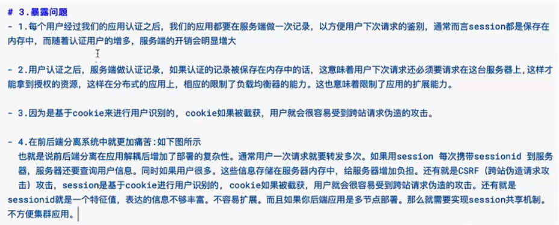
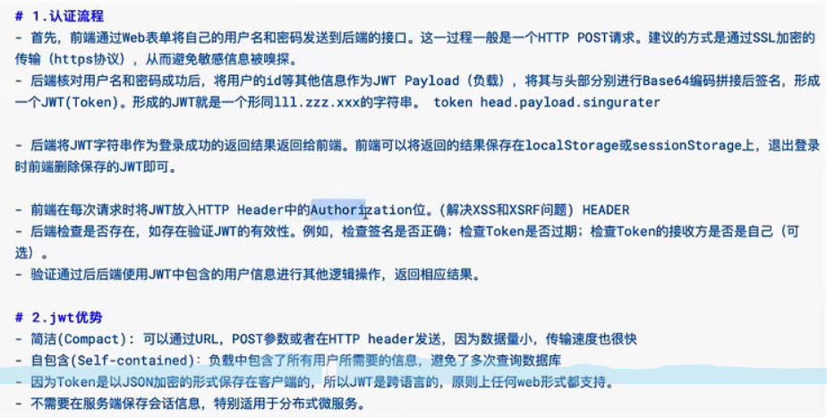

# JWT(JSON WEB TOKEN)

- [【编程不良人】JWT认证原理、流程整合springboot实战应用,前后端分离认证的解决方案!_哔哩哔哩_bilibili](https://www.bilibili.com/video/BV1i54y1m7cP?from=search&seid=1528662029296040044&spm_id_from=333.337.0.0)

- [你在用 JWT 代替 Session?_weixin_33851429的博客-CSDN博客](https://blog.csdn.net/weixin_33851429/article/details/88737668)

- [CAS单点登录原理分析(一)_小鬼哥的博客-CSDN博客_cas单点登录](https://blog.csdn.net/qq_41258204/article/details/84036875)

- [看图理解JWT如何用于单点登录 - 谢青 - 博客园 (cnblogs.com)](https://www.cnblogs.com/xieqing/p/6519907.html)

- [Hutool中 常用的工具类和方法_Maverick Programmer的博客-CSDN博客_hutool工具类](https://blog.csdn.net/Bingxuebojue/article/details/120477946)

- [如何在前端实现从JWT中提取用户id？ - 问答 - 云+社区 - 腾讯云 (tencent.com)](https://cloud.tencent.com/developer/ask/sof/882607)

- jwt一种令牌生成策略，每次进行请求时都需要将这个令牌携带，后端会验证令牌的合法性。如果合法就放行。不合法就拒绝。

- 主要作用安全验证和权限控制

  

  

- 组成：三个部分分别用**.**进行隔开。前两个部分相当于数字签名的明文。

  - Header：将这部分信息通过Base64进行编码就可以得到我们令牌的第一部分信息。-----信息头部，通常不会进行加密

    - [Base64加密_旺旺&娇娇的博客-CSDN博客_base64加密](https://blog.csdn.net/qq_56005036/article/details/117356263)

    ```json
    {
        'type':'JWT',令牌类型
        'alg':'HS256' jwt推荐的加密算法
    }
    ```

    

  - Payload：载荷，存放有效信息的地方。通常也仅仅进行base64编码，不进行加密。----信息身体
  
    ```json
    {
       'sub':,
        'name':,
        'admin':
    }
    ```
  
    
  
  - Signature---信息签名（将上面两者进行加密算法加密就是签名，签名解析后得到的就是）
  
    - 前面两个部分使用的BASE64进行编码，也就是前端可以解开直到里面的信息。**Signature需要使用编码后的header和playload以及我们提供的一个密钥，然后使用header中指定的签名算法(HS256）进行签名。**签名的作用是保证JWT没有被篡改过（一方面是明文是否被篡改过，一方面是签名本身是否是伪造）。
    - 大致流程：
      - 将头部和载荷转换为base64
      - 随机生成密钥
      - 用密钥以及指定的加密算法将头部和载荷转换为base64的字符串进行加密。最终得到签名。
      - 最后这三个部分用点拼接就是jwt，每次请求服务时都会将这个jwt进行传输。当接收到请求时就会进行验证jwt，将明文部分和加密密钥以及加密算法再次进行运算，如果能够得到匹配的签名则信息有效否则信息被篡改过。
  
  - 通过加密算法再次将负荷进行运算即可验证签名是否合法、信息是否完整。
  
  ```xml
  <dependency>
  	<groupId>com.auth0</groupId>
      <artifactId>java-jwt</artifactId>
      <version>3.4.0</version>
  </dependency>
  ```
  
  
  
- 通常将jwt设置在请求头中

- jwt的api可以进行链式调用

# 单点登录

- SSO

- 就是在某一个系统进行登录之后，在该系统信任的地方就不需要再次进行登录。通常是建立一个认证中心（微服务中的登录注册服务），进行统一的身份认证，然后分发统一通行令牌，其他信任系统就可以根据令牌进行判断是否需要可以放行。

- 单点登录可以常用方式

  - session+token+redis:统一认证，认证后生成令牌，令牌放在redis中，相关数据也是如此。程序请求验证令牌，合法放行，通常都会到redis中进行验证，为了节省时间和减轻redis压力，可以在session中存储令牌和数据，每次先验证session，再验证reids。

    - 好处，数据存储在服务端，可控性强，令牌的有效时间可以轻松管理。
    - 坏处，中心化，水平扩展难，也就是说都依赖于认证中心，受限于认证中心。

  - jwt:

    - 每次登录，下发令牌，令牌中携带数据，存储在客户端，每次验证令牌合法性即可。

    - 好处：去中心化，服务端数据压力降低，不用每次都去访问redis,扩展方便，不用依赖认证服务，自身就可以认证。
    - 坏处：不可控，一旦令牌下发就不受服务端控制，要控制就必须要额外的表单（黑名单）。要共享又需要引入redis。所以会多此一举。其次，系统额外传输的数据量会增大，同时需要加密、编码解码运算，需要额外性能。

  - 对比：jwt就是将redis和服务端压力转移到服务端和客户端。如果你信任你下发的令牌，不会控制它，那么可以使用jwt，比如在内网中的程序。如果你不信任，希望能够受控制，就使用session、token、redis，往往外网用这个。

  - 通过JWT实现的单点登录框架CAS（每个服务持有一个认证客户端，每次请求看是否需要重定向到CAS服务端进行验证，如果需要就验证，服务端验证是否登录，没有就拉取登录界面，有就返回给CAS客户端，放行。）

# Base64

- 编码：
  - 确定数据data字符串使用字符集，一般是utf-8.
  - 查询每个字符对应字符集编码
  - 将这个编码转换为二进制流
  - 分割二进制流（6位一组，因为64个字符），不足六位补0
  - 将每组二进制流转换为十进制，并查询base64字符集，得到最终的编码结果。
- 解码：就是逆向映射过程
- base64仅仅是一种字符串转换工具，并谈不上是加密算法。它的目的是解决无法直接传输的字符问题。通过二次编码将字符串全部转换为小字符集，从而使得字符串在传输过程能够全部传输，不会失真。也就是网络传输往往都会将传输内容转换为base64编码再进行传输。**很多时候，我们都将Base64编码作为数据加密后的传输 / 存储格式**

# 系统的各种类别对象

- VO
  - 视图层对象，也就是前端展示的对象，当前后端进行分离时，独立在前端，比如用angular进行开发，它会建立自己的数据模型就是VO
- DTO
  - 数据传输对象，服务与服务之间，前端后后端通信时传输的对象，我们通常使用的是JSON，但是JSON对应的数据的对象就是DTO，我们前后端应该统一DTO类型，便于相互之间进行JSON映射。
- BO
  - 服务内部使用业务对象，一个服务端内部往往是有多个业务逻辑的，有的业务逻辑模块之间可能存在相互调用，或者说层与层之间相互调用，这些调用之间通常就是使用接口。这个通常我们使用的是基本类型、集合框架和POJO，除非特别复杂的类型，一般是不会进行设计
- PO
  - 持久化对象，应用系统与数据库交互的对象，也就是我们常常说的POJO ，但是POJO包含的范围更广，但是大部分POJO都是PO

#常见的攻击手段

- [【渗透基础系列】一文读懂XSS、CSRF、SSRF、XXE漏洞原理、应用、防御 (360doc.com)](http://www.360doc.com/content/22/0330/07/77981587_1023973935.shtml)
- [sessionId安全性_yjc0403的博客-CSDN博客](https://blog.csdn.net/yjc0403/article/details/84825028)

## 个人理解

- 通常web通信，因为http是无状态协议，如果要保证客户端和服务器保持状态会话，就需要一些标识进行记录并且双方进行保存，常用的就是cookie、session。而个人相关信息往往就保存在其中，只要每次访问网站时带上这些信息就能通过服务器验证。所以如果我们将用户的数据包窃取并持有发送，那么我们就可以通过这个数据包完成持续的身份验证（这就是重放攻击，往往是注册或者是登录时）。这个解决方法往往使用时间戳进行附加验证，利用被窃取的时间差降低攻击成功的风险（附加时间戳或者是定时验证码）。既然直接抓包没法通信，我们就只能想办法获取到通信的信息，要么窃取到用户的账号和密码，要么就借助会话信息通过验证。因为时间戳导致重放cookie无法通过身份验证。
