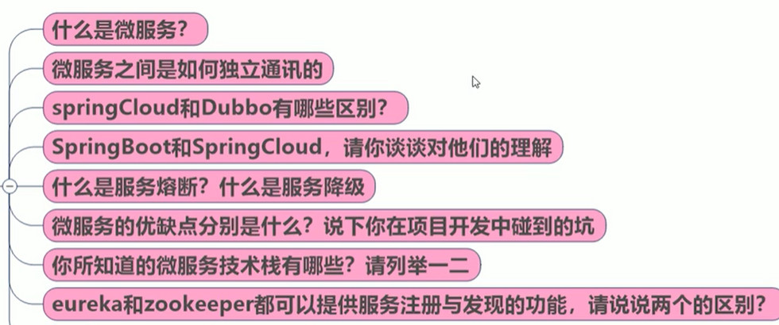
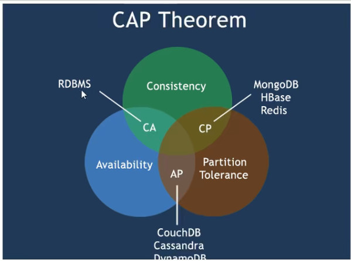
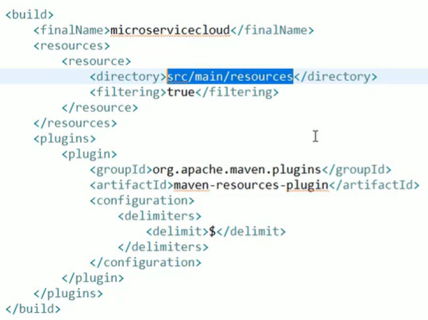
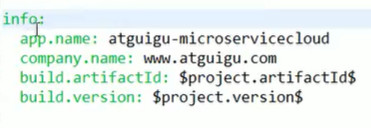
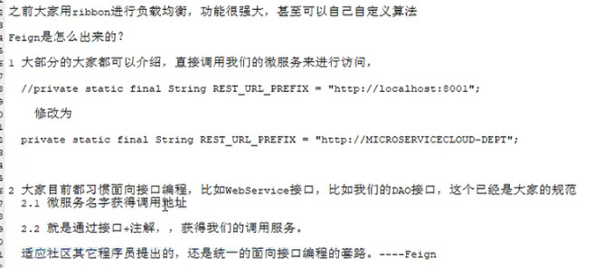

# 微服务与分布式之间的关系

- 天下大势分久必合合久必分
- 用这篇文章引入微服务便于理解

  - [分布式？微服务？到底怎么学？ - 墨天轮 (modb.pro)](https://www.modb.pro/db/152621)
  - [SpringCloud微服务架构需要学习哪些知识点？ (baidu.com)](https://baijiahao.baidu.com/s?id=1694003766875174790&wfr=spider&for=pc)
- 微服务是一种架构风格
- 每个服务运行在自己的进程内，可独立部署升级
- 服务之间使用轻量级http交互
- 服务围绕业务功能拆分
- 可以由全自动部署机制独立部署
- 去中心化，服务自治。服务可以使用不同的语言，不同的存储技术
- 分布式问题：springboot+springcloud解决
  - 远程调用
  - 服务发现
  - 负载均衡
  - 服务容错
  - 配置管理
  - 服务监控
  - 链路追踪
  - 日志管理
- 分布式维护问题：
  - 部署到云：云原生
    - 服务自愈
    - 弹性伸缩
    - 服务隔离
    - 自动化部署
    - 灰度发布
    - 流量治理
- 总结：微服务架构是一种服务之间低耦合、服务自身高度自治（独立构建和部署、集成、维护、销毁，拥有自己的数据库），使用轻量级的通信协议的可持续集成的分布式架构。微服务就是指是微服务架构中的独立的服务模块（微服务并没有什么特别，不过是小而已，建议解释的时候直接从分治法入题）。
  - 优点：内聚，小而灵活，高扩展、高可用、高性能，可以跨语言，跨平台
  - 缺点：分布式的复杂，运维成本大，服务之间通信成本，**数据一致性**，集成测试困难，性能监控
- 微服务技术栈：
  - 服务开发：我们说不限于语言与平台，具体到Java上就是springboot、ssm等等
  - 服务配置与管理：Netflix的archaius，阿里的diamond
  - 服务注册与发现：eureka、consul、zookeeper
  - 服务之间相互调用:http的restful、RPC、gRPC
  - 服务熔断器:hystrix、envoy
  - 负载均衡：ribbon、nginx
  - 服务客户端接口调用：Feign
  - 消息队列：Kafka、Rabbit MQ、Active MQ
  - 服务配置中心管理：SpringCloudConfig、Chef
  - 服务路由（API网关）:Zuul
  - 服务监控:Zabbix、Nagios
  - 全链路追踪
  - 服务部署：Docker、K8s
  - 数据流操作开发包:springcloud stream
  - 事件消息总线:spring cloud bus

## 目前成熟的互联网结构（分布式+服务治理Dubbo）

- [尚硅谷经典SpringCloud框架开发教程全套完整版从入门到精通(大牛讲授spring cloud)_哔哩哔哩_bilibili](https://www.bilibili.com/video/BV1wW411V7Df?p=12&spm_id_from=pageDriver)

- **[到底什么是CDN？ - 知乎 (zhihu.com)](https://zhuanlan.zhihu.com/p/338951935)**

- **[前端工程CDN部署_前端粉刷匠的博客-CSDN博客_前端资源放在cdn上怎么部署](https://blog.csdn.net/sxm666666/article/details/111175007)**

- [区块链是什么，如何简单易懂地介绍区块链？ - 知乎 (zhihu.com)](https://www.zhihu.com/question/37290469)

- [lvs详解 - 知乎 (zhihu.com)](https://zhuanlan.zhihu.com/p/445202915)

- [简单介绍正向、反向和透明代理服务器_白菜CC的博客-CSDN博客_透明代理服务器](https://blog.csdn.net/weixin_47740244/article/details/106678934)

- CAP

  - C：一致性
  - A:可用性
  - P：分区容错性
  - 分布式必须要保证P-因为这个是一定会发生的，而P一旦发生，CA就不能完全保证了，如果要保证C，那么就必须先解决分区网络通信。
  - **Consistency：** 一致性；client1和client2分别从db读取v0,现client1将v0改成v1,client2读取的值也为v1，这就叫一致性
  - **Availability：** 可用性；服务器收到请求后就必须给出回应
  - **Partition tolerance：** 分区容错；分布式系统一般都分布在多个子网络（区），分区容错即值区与区之间通信可能会失败。如一台服务器在中国，一台在美国，这两个区就可能无法通信。
  - **因为P一定会出现，那么无法通信的双方，如果你让他们继续提供服务-A，那么这两者的数据一致性-C就无法保证。如果你为了保证数据一致性，那么就只能停止整个服务，去修复双方通信，那么就只能放弃A**
  - [EureKa为什么要设定一个貌似鸡肋的自我保护机制？ - 知乎 (zhihu.com)](https://zhuanlan.zhihu.com/p/69765596)

- BASE理论：

  - Ba：服务基本可用，当服务资源出现问题时，首先要保证更重要的服务可以运行

    S：软状态，整个系统允许某个时刻出现弱一致性状态

    e：最终一致性，当系统分区问题解决后，整个数据会回归到一致性的状态。

- 客户请求如果是静态资源请求就通过CDN处理。在客户请求的资源或者请求的是动态的资源时就需要将请求转到系统的网关处（常常用的LVS虚拟网关，充当对外系统接口以及防火墙,可以说是一个**正向代理**），网关将请求发送到内部局域网，通过nginx进行负载均衡，**反向代理**，以及动静分离，静态资源放在统一的文件系统。最终确定请求应该交给哪一台具体的服务器，如果是静态请求，就直接数据返回，如果是动态就需要将......

- 微服务的核心就是分割业务形成独立服务，然后组装为一个完整大系统。所以只要能够做分（分别开发）以及归并（相互调用），就算的上微服务。其他就是锦上添花，且更多是分布式上的问题。微服务架构一定是分布式的。
  - dubbo服务注册和发现依赖于zookeeper，服务调用方式通过RPC，监控提供monitor。理论上说微服务只要能保证服务分割以及相互之间的通信调用那么就可以算的上是微服务，所以dubbo用作微服务完全可行。只是其他方面需要我们自己去组装、实现、扩展等等。相比sc功能就很全。
  - **dubbo的定位始终只是RPC框架，而sc是微服务架构下的一栈式解决发难**

## 服务网关

- [2021最新版-SpringCloud-微服务-Zuul服务网关框架搭建-通俗易懂附配套资料_哔哩哔哩_bilibili](https://www.bilibili.com/video/BV1m64y1W7es?p=6&spm_id_from=pageDriver)

- API网关，故名思议，是出现在系统边界上的一个面向API的、**串行集中式**的强管服务，这里的边界是企业IT系统的边界，可以理解为企业级应用防火墙，主要起到隔离外部访问与内部系统的作用。在微服务概念流行之前，API网关就已经诞生了，例如银行、整卷等领域常见的前置机系统，他也是解决访问认证、报文转换、访问统计等问题。
- API网关的流行，源于近几年来移动应用与应用企业间互联需求的兴起。移动因公用、企业互联，使得后台服务支持的对象，从以前单一的web应用，扩展到多种使用场景，且每种使用场景对后台服务的要求都不尽相同。这不仅增加了后台服务的响应量，还增加了后台服务的复杂性。随着微服务架构概念的提出，API网关称为了微服务架构的一个标配组件。
- API网关是一个服务器，是系统对外的唯一入口。API网关封装了系统内部架构，为每个客户端提供定制的API。所有的客户端和消费端都通过统一的网关接入微服务，在网关层处理所有非业务功能。API网关并不是微服务场景中必须的组件，只使用服务发现，提供服务客户端，同样能够使得整个微服务系统运行。
- 好处：
  - 聚合接口使得服务对调用者透明，客户端与后端的耦合度降低
    - 假如我们要将后端服务进行变更，比如说变更服务的接口，那么你可以不用变更服务客户端的映射接口，但是往往服务客户端和服务端是一一匹配的，且主要是提供给服务之间相互访问，所以我们最好使用一个完全独立的虚拟路径提供给用户访问，然后后端就随意变换了。
  - 聚合后台服务，节省流量，提高性能，提升用户体验
  - 提供安全、流控、过滤、缓存、计费、监控等API
- **微服务的应用（分布式系统）可能部署在不同机房，不同地区，不同域名下。此时客户端想要请求对应的服务，都需要知道机器的具体IP或者域名URL，当微服务实例众多时，这是非常难以记忆的，对于客户端来说也太复杂，此时就有了网关，客户端相关的请求直接发送到网关，由网关根据请求表示解析哦按段出具体的微服务地址，再把请求转发到微服务实例，者其中的记忆功能就全部交由网关来操作了。而且借助网关，我们可以实现自己的局域网，这也是减少一部分网络费用开销。**
- 如果让客户端直接与各个微服务交互：
  - 客户端会多次请求不同的微服务，增加了客户端的复杂性
  - 存在跨域请求，再一定场景下处理相对复杂
  - 身份认证问题，每个微服务实例需要独立身份认证，那么每个服务都要制定一个拦截器然后到认证中心验证，那么意味着所有服务请求到达服务客户端后先请求认证中心，而且服务之间相互调用时也会再次进行验证。
  - 难以重构，随着项目的迭代，可能需要重新划分微服务
  - 某些微服务可能使用了防火墙/浏览器不友好的协议，直接访问会有一定的困难
- 因此，我们需要网关介于客户端与服务器之间的中间层，所有外部请求率先经过微服务网关，客户端只需要与网关交互，只需要知道网关地址即可。这样便简化了开发且有一下优点：
  - 易于监控，可在微服务网关手机监控数据并将其推送到外部系统进行分析
  - 易于认证，可在微服务网关上进行认证，然后再将请求转发到后端的微服务，从而无需在每个微服务中进行认证
  - 减少了客户端与各个微服务之间的交互次数
- 网关作用
  - 流量监控
  - 安全防护：IP黑名单、URL黑名单、风控防刷
  - 统一接入：容灾切换（异地多活）-就是尽量分散逃，通过统一的网关进行联系，卧底联系人。
  - 协议适配
- 网关具有身份认证与安全、审查与监控、动态路由、负载均衡、缓存、请求分片与管理、静态响应处理等功能。当然最主要的职责还是与“外界联系”。
  - 性能：API高可用
  - 安全：权限身份认证、脱敏、流量清晰，后端签名（保证全链路可信调用），黑名单（非法调用的限制）
  - 日志L日志记录，一旦涉及分布式，全链路跟踪必不可少
  - 缓存：数据缓存
  - 监控：记录请求想用数据、API耗时分析、性能监控
  - 限流：流量控制、错峰流控、可以定义多种限流规则
  - 灰度：线上灰度部署，可以减小风险
  - 路由：动态路由规则
- hystrix客户端限流与zuul网关限流：大小问题，后者可用范围更大，一个网关可以代理多个服务，那么它限制的是整体的流量(**或者说它限制的是它自己这个入口的流量-它本身也是一个微服务**)，这个整体的流量可存在都调用某个服务，那么这个是限制不了具体服务的流量的。而hystrix是限制服务实例的流量，因为每个服务实例独立部署。但是你可以为每个服务单独配置网关，那么就可以进行单个服务限流。
- **网关也是可以按层搭建，从大网关，到聚合网关，到服务网关，逐级负载。**
- Zuul这类软件网关（**这类网关没有实现服务通信，需要依赖于服务器-tomcat实现客户服务端通信**）相比nginx服务网关（**这类网关实现有自己的通信协议只要提供操作系统就能够直接运行接收请求**），前者更加灵活，再配合配置中心可以灵活路由服务，可用性、可维护性、可扩展性都比nginx要高。

# SpringCloud

- [SpringCloudAlibaba和SpringCloud的区别_fanaozhe的博客-CSDN博客_springcloudalibaba和springcloud](https://blog.csdn.net/weixin_39737132/article/details/112148214)
- [dubbo和spring cloud区别 (baidu.com)](https://baijiahao.baidu.com/s?id=1726348086684196148)
- dubbo、hsu、JSF、Motan、sc
- sc提供基于spring boot一系列的微服务解决方案。可以说就是一套简单、好用的分布式系统工具包
- 分布式微服务架构下的一站式解决方案，是各个微服务架构落地技术的集合体，书城微服务全家桶。
- sb与sc之间的关系，sb关注快速业务逻辑开发，sc是宏观的，关注整个系统全局的服务治理。
- [Spring Cloud中文网-官方文档中文版](https://www.springcloud.cc/)
- **注意sc依赖于sb，要注意两者的版本号对应关系**
  - 1.5和D版
  - 2.2.0-2.2.5和H版

## 现在编写服务程序我们需要做些哪些内容

- 首先业务程序，也就是我们常常用SSM进行编写的逻辑以及依赖资源等等，现在使用spring boot进行构建。我们可以说它是服务服务端
  - 这个构建我们通常将依赖建立一个父项目进行管理，或者说建立一个单独的项目，然后封装为jar,其他项目进行引入依赖。通常实体类以及相关工具类也是新建项目然后封装为依赖。
  - 配置信息与springboot一致
  - 这个你可以使用spring boot创建项目，也可以使用直接导入依赖创建。
  - 可以说这个实现了业务逻辑分开实现
- 然后我们新建一个springboot，作为将服务客户端，这个客户端只用编写controller层，以及对应的要访问的服务服务端路径配置。
  - 意义一：真正的服务端透明化，结合注册中心将变为一个抽象的服务，具体多少台，具体位置将全部隐藏。水平扩展变得容易了。
  - 意义2：当服务端被隐藏起来，那么就需要对外暴露一个接口，客户端通过这个接口进行调用服务。完成服务接口暴露。且能够二次映射，就是改变服务端的资源路径，将真正的路径隐藏起来。
  - 通过这一层将使得客户端与服务端彻底解耦，你可以说它是一个反向代理，负载均衡。毕竟代理本就可以增强。还可以说通过这个可以将小服务组装为大服务，这个是但是不建议这么做。
- 组装其他必要的组件，可以说上两者完全完成了分合的目的。但是这往往不够。
- RestTemplate，spring提供的调用http请求方式，参数：**url-请求路径、requestMap-请求参数、ResponseBean.class-响应类型**

## springcloud5大组件



- 导入依赖
- 编写组件配置
- 在启动器上添加EnablbXXXX组件依赖
- 配置类
- [ribbon需要读取eureka那 - CSDN](https://www.csdn.net/tags/NtTaggzsNTgyNTMtYmxvZwO0O0OO0O0O.html)

### Euraka

- [Eureka入门配置_晓倾城的博客-CSDN博客_eureka安装和配置](https://blog.csdn.net/qq_40850266/article/details/118656732)

- [springcloud学习手册-Eureka(第一节) - 阅读清单 - 云+社区 - 腾讯云 (tencent.com)](https://cloud.tencent.com/developer/inventory/9321/article/1056618)

- [Eureka自我保护机制含义及原理分析-群英 (qycn.com)](https://www.qycn.com/zx/wlaq/anquanjishu/2020/0901/135.html)

- [服务注册Eureka基础 - 许大仙 - 博客园 (cnblogs.com)](https://www.cnblogs.com/xuweiweiwoaini/p/13726528.html)

- Eureka是[Netflix](https://baike.baidu.com/item/Netflix/662557)开发的服务发现框架，本身是一个基于[REST](https://baike.baidu.com/item/REST/6330506)的服务，主要用于定位运行在AWS域中的中间层服务，以达到负载均衡和中间层服务故障转移的目的。静态服务监测和户保护

- 相比较服务注册传统的nginx负载均衡,这个相当于进行了一次过滤，将服务的治理拿出来单独管理，如果要负载均衡再在这个基础上进行分配。而nginx管理这块还是由自己进行管理。

- eureka的自动保护？

  - [EureKa为什么要设定一个貌似鸡肋的自我保护机制？ - 知乎 (zhihu.com)](https://zhuanlan.zhihu.com/p/69765596)

  - 自我保护：某一时刻某个微服务不可用（可能宕机，可能网络不通，可能服务变更-比如更换实例id）

  - 自我保护机制的工作机制是：**如果在15分钟内超过85%的[客户端](https://www.zhihu.com/search?q=客户端&search_source=Entity&hybrid_search_source=Entity&hybrid_search_extra={"sourceType"%3A"article"%2C"sourceId"%3A"415692898"})节点都没有正常的心跳，那么Eureka就认为客户端与注册中心出现了网络故障，Eureka Server自动进入自我保护机制**，此时会出现以下几种情况：下面的情况都是基于**BASE理论**的

    1. Eureka Server不再从注册列表中移除因为长时间没收到心跳而应该过期的服务。
    2. Eureka Server仍然能够接受新服务的注册和查询请求，但是不会被同步到其它节点上，保证当前节点依然可用。
    3. 当网络稳定时，当前Eureka Server新的注册信息会被同步到其它节点中。

    因此Eureka Server可以很好的应对因网络 故障导致部分节点失联的情况，而不会像ZK那样如果有一半不可用的情况会导致整个集群不可用而变成瘫痪。

- 服务发现

  - 就是让服务之间互相能够知道彼此的存在

  - 通过注入DiscoveryClient实例实现。通过这个实例能够拿取到注册中心的注册的服务，从而得知服务的信息。你可以通过这些信息来调用服务，但是本意不是这样，主要用于监控。

- **eureka配置集群时不用声明自身为注册中心，只需要将其他的注册中心进行声明**。
  - 应该每一台eureka服务端会先自动用主机名和端口暴露自己，然后与其他注册中心形成集群。彼此同步服务注册表。
  - 每个服务需要向所有的eureka注册自己，注意eureka服务端只声明了其他注册中心，并没有声明自己。尽量**避免不一致性**

- **Zookeeper和Eureka的区别：**

  

  1、zk是cp设计，eureka是ap设计

  2、zk集群有角色(由主从角色区分，也就是读写分离，主从复制，哨兵模式选举主节点，能够保证一致性，但是如果主节点瘫痪会导致在这个期间重新选取主节点，从而导致注册中心不可用，从而使得系统这个时间段是不可用的)，eureka集群没有角色（所有节点平等，都可以对外提供服务，某个节点瘫痪不会进行选举，）。**从角色这个点可以看出，zk是中心化的，ek是去中心化的。那么ek的部署就更灵活**

  3、zk提供了watch机制，eureka是通过长轮询实现

- eureka坐标

  ```xml
  服务端：
  spring-cloud-starter-eureka-server
  客户端：
  spring-cloud-starter-eureka
  ```

  

- eureka服务端

  ```yaml
  server:
    port: 8761
  
  # eureka 配置
  # eureka 一共有4部分 配置
  # 1. dashboard:eureka的web控制台配置
  # 2. server:eureka的服务端配置
  # 3. client:eureka的客户端配置
  # 4. instance:eureka的实例配置
  eureka:
    instance:
      hostname: localhost # 主机名，域名
    client:
      service-url:
        defaultZone: http://${eureka.instance.hostname}:${server.port}/eureka # eureka服务端地址，将来客户端使用该地址和eureka进行通信，查询服务和注册服务的地址。（可以说是注册中心的地址）
  
      register-with-eureka: false # 是否将自己的路径 注册到eureka上。eureka server 不需要的，eureka provider client 需要
      fetch-registry: false  # 是否需要从eureka中抓取路径。eureka server 不需要的，eureka consumer client 需要
    server:
      enable-self-preservation: false  #关闭自我保护机制
      eviction-interval-timer-in-ms: 3000 #检查服务的时间间隔
  
  ```
  
  
  
- eureka客户端:这个与相应的服务进行整合在一起并在服务启动器上启动使用，

  ```yaml
  server:
    port: 8000
  eureka:
    instance:
      hostname: localhost # 主机名
      prefer-ip-address: true #将当前实例的ip注册到Eu热卡Server里
      ip-address: 127.0.0.1  #设置当前实例的ip
      instance-id: ${eureka.instance.ip-address}:${spring.application.name}:${server.port} #3部分：ip：应用名称: 端口   设置实例的ip  web控制台显示的id
      lease-expiration-duration-in-seconds: 3  #每隔3秒一次发送心跳包
      lease-renewal-interval-in-seconds: 9  #如果9秒没发  就剔除服务
  
    client:
      service-url:
        defaultZone: http://localhost:8761/eureka # eureka服务端地址，将来客户端使用该地址和eureka进行通信
  spring:
    application:
      name: eureka-provider # 设置当前应用的名称。将来会在eureka中Application显示。将来需要使用该名称来获取路径
  ```

  - 一个服务对应多个eureka客户端实例

####actuator

- [Spring Boot Actuator 配置和应用 - 光焱 - 博客园 (cnblogs.com)](https://www.cnblogs.com/eagle6688/p/14247822.html)

- spring boot的服务监控插件

- 引入监控启动依赖

- 编写pom配置

  

- 配置监控信息

  

### Ribbon

- springcloud ribbon 是基于netflix ribbon实现的一套客户端 负载均衡工具。

- 全球最大的互联网视频提供商Netflix在自己的技术团队博客上[发布文章](http://techblog.netflix.com/2013/01/announcing-ribbon-tying-netflix-mid.html)，对外公布了他们的开源项目Ribbon，其主要功能是将Netflix的中间层服务连接在一起。

  Ribbon，简单说，**主要提供客户侧的软件负载均衡算法。**和其他构成我们NIWS内部进程通信栈的组件一起，该算法在Netflix经历了严峻考验。

  

  ****

  简单说，**主要提供客户侧的软件负载均衡算法。ribbon客户端组件提供一系列完善的配置项如连接超时，重试等。简单说，就是在配置文件中列出Load Balancer后面所有的机器，ribbon会自动的帮助你基于某种规则（如简单轮询，随机连接等）去连接这些机器。我们也很容易使用ribbon实现自定义的负载均衡算法。**

  ****

  LB，即负载均衡，在微服务或分布式集群中经常用的一种应用。负载均衡简单的说就是用户请求分摊到多个提供相同服务的服务上，从未达到系统的HA。常见的负载均衡有软件Nginx,LVS,硬件F5等。

  ****

  集中式LB：在服务的消费方和提供方之间使用独立的LB设施（可以是硬件，F5，也可以是软件，如nginx）,由该设施负责把访问请求通过某种策略转发至服务提供方。

  ****

  进程内LB：将LB逻辑集成到消费方，消费方从服务注册中心获知有哪些地址可用，然后自己再从这些地址中选择处一个合适的服务器。Ribbon就属于进程内LB。

  ****

  [Ribbon与Nginx的区别 - Marlo - 博客园 (cnblogs.com)](https://www.cnblogs.com/Marlo/p/14840954.html)

  ```tex
  ribbon和Nginx的区别
  
  1.服务器端负载均衡 Nginx
  nginx 是客户端所有请求统一交给 nginx，由 nginx 进行实现负载均衡请求转发，属于服务器端负载均衡。
  既请求由 nginx 服务器端进行转发。
  
  2.客户端负载均衡 Ribbon
  Ribbon 是从 eureka 注册中心服务器端上获取服务注册信息列表，缓存到本地，然后在本地实现轮询负载均衡策略。
  既在客户端实现负载均衡。
  
  应用场景的区别：
  
  （1）Nginx适合于服务器端实现负载均衡比如 Tomcat ，Ribbon适合与在微服务中RPC远程调用实现本地服务负载均衡，比如 Dubbo、SpringCloud 中都是采用本地负载均衡。
  
  spring cloud的Netflix中提供了两个组件实现软负载均衡调用：ribbon和feign。
  
  （2）Ribbon
  
  是一个基于 HTTP 和 TCP 客户端的负载均衡器
  
  它可以在客户端配置 ribbonServerList（服务端列表），然后轮询请求以实现均衡负载。
  
  springcloud的ribbon和nginx有什么区别？哪个性能好？
  nginx性能好，但ribbon可以剔除不健康节点，nginx剔除节点比较复杂。ribbon还可以配合熔断器一起工作
  
  ribbon是客户端负载均衡，nginx是服务端负载均衡。客户端负载均衡，所有客户端节点都维护自己要访问的服务端清单。服务端负载均衡的软件模块会维护一个可用的服务清单
  
  ribbon 是一个客户端负载均衡器，可以简单的理解成类似于 nginx的负载均衡模块的功能。
  ```

  

- ribbon坐标：

  ```xml
  在服务客户端引入依赖：
  spring-cloud-starter-ribbon
  ```

  

- 使用负载均衡：

  - 在RestTemplete的配置类的对应的注册方法上，添加注解**@LoadBalanced**,当服务客户端拿取这个模板进行服务端进行访问时会先进行负载均衡算法得到最终访问的服务实例，然后再通过模板进行调用。但是客户本身是感觉不到的，你只知道要访问哪个服务名，具体访问谁是负载均衡后决定的。

- 启用ribbon客户端

  - 在启动程序上添加：**@EnableEurekaClient**

- 修改服务客户端访问服务端的方式，以前我们使用具体的ip和URI进行访问，现在我们通过**http://服务提供者的名字/URI**进行访问。就是将IP换为在eureka中注册的服务名。

  ****

  **ribbon和eureka整合后服务客户端可以直接调用服务而不再关心地址和端口号**。也就是如果没有ribbon就不能通过服务名进行访问？？？？？

####ribbon的负载均衡

- 大致架构：多个服务实例、eureka、一个服务客户端

  - 所有服务实例注册eureka上
  - 服务客户端拉取相关服务列表
  - ribbon进行负载策略选取要调用的具体服务实例，并发起请求。

- ribbon负载均衡步骤：

  - 先选择eureka服务端，优先选择在同一个区域内负载较少的server，然后拉取服务注册表。？它是怎么判定出这个服务的？
  - 再根据用户指定策略，在从server取到的服务注册列表中选择一个地址
  - **ribbon提供多种策略：轮询、随机、响应时间加权、**

  ```tex
  Ribbon的默认内置了7种负载均衡策略：
  
   
  
  1、RoundRobinRule
  
  　　轮询策略，Rabbon默认采用的策略，若经过一轮轮询没有找到可用的provider(提供者)，其最多轮询10轮，若最终
  
        没有找到，则返回NULL。
  
        举例：当前有3个提供者A,B,C，先挨个轮询1遍，A,B,C都不访问（1轮），在A,B,C访问一遍（2轮次），一共试10轮
  
                  如果还不能访问，则返回NULL。
  
   
  
  2、RandomRule
  
  　　随机策略，从所有可用的provider(提供者)中选择一个。
  
   
  
  3、RetryRule
  
  　　重试策略，先按照RoundRobinRule策略获取provider(策略者)能获取到直接返回，若获取失败，则在指定的时限内重试，
  
         默认的时限为500毫秒。【RoundRobinRule轮询策略，默认是10轮，而RetryRule我给你500毫秒，你可以一直重试，直到找到为止】
  
   
  
  4、BestAvailableRule
  
  　　最可用策略。选择并发量最小的provider（提供者）, 即连接的消费者数量最少的provider 。
  
   
  
  5、AvailabilityFilteringRule
  
  　　可用过滤算法。该算法规则是：过滤掉处于熔断状态的provider与已经超过连接极限的provider,对剩余provider采用轮询策略。
  
   
  
  6、ZoneAvoidanceRule
  
  　　zone回避策略。根据provider所在zone及provider的可用性，对provider进行选择。
  
   
  
  7、WeightedResponseTimeRule
  
  　　“权重响应时间”策略。根据每个provider的平均响应时间计算其权重，响应时间越快权重越大，被选中的机率就越高。
  
       在刚启动时采用轮询策略。后面就会根据权重进行选择了。
  ```

  

#### 自定义策略IRule

- 所有的负载策略都是实现了这个接口。

- ribbon托管到spring中，自己配置了一个IRule，其实例是轮询策略实例。如果我们要使用自己想用的策略那么就需要自己配置注册一个IRule进行覆盖。

- 在服务客户端配置一个IRule即可。配置你可以使用七种ribbon自带的策略实例化，也可以自己实现IRule接口然后实例化。

- **第二种使用方案**

  - 使用@RibbonClient(name="要调用的微服务名",configuration=MySelfRule.class)
    - 后面的类是自定义的ribbon策略配置类，这个类名随便写。
  - **MySelfRule这个类不能放在启动类所在的包下。官方要求不能和@ComponentScan同包**。
  - 那么就在其外新建一个包，再新建一个MySelfRule类，使用@Configuration标注，在这个类中注册一个IRule实例。

- 自己重写负载均衡策略

  ```java
  public class NewRule extends AbstractLoadBalancerRule {
  
      /**
       * 所有的自定义策略都是继承至这个类
       */
  	//实际就是选取服务实例的逻辑，然后将服务返回
  	@Override
  	public Server choose(Object key) {
          
  		return ;
  	}
  }
  ```

  - 实现后将这个类在配置类中进行注册即可


###Feign

- **[Feign详解与实例 - 百度文库 (baidu.com)](https://wenku.baidu.com/view/650744cc5df7ba0d4a7302768e9951e79b8969e6.html)**

- feign是一个声明式WebService客户端。使用feign能让编写服务客户端更加简单，它使用的方法是定义一个接口，然后在上面添加注解，同时也支持JAX-RS标准的注解。Feign也支持可插拔式的编码器和解码器。springcloud对Fegin进行了封装，使其支持了springMVC标准注解和HttpMessageConverters。Feign可以与Eureka和Ribbon组合使用以支持负载均衡。

  

- 就是说这个组件要将RestTemplate的调用服务的方式重新封装一下，后端就按照后端的接口编程来，不要像前端一样调用通过URL来进行调用。**也就是最好按照层次划分的角度来调用。**

- **前面在使用ribbon+resttemplate时，利用rest template对HTTP请求的封装处理，形成了一套模板化的调用方法。但是在实际开发中，由于对服务依赖的调用可能不止一处，往往一个接口会被多处调用，所通常都会针对每个微服务自行封装一些客户端类来包装这些依赖服务的调用。所以，Feign在此基础上做了进一步封装，由它来帮助我们定义和实现依赖服务接口的定义。在Feign的实现下，我们只需创建一个接口并使用注解的方式来配置它（以前是DAO接口上标注Mapper注解，现在是一个微服务接口上面标注一个Feign注解即可），即可完成对服务提供方的接口绑定，简化了使用spring ribbon时，自动封装服务调用客户端的开发量**

  ****

- 在公共模块中引入feign依赖：spring-cloud-starter-feign

- 在公共调用模块中新建service包并编写一个接口,**这些接口应该和服务服务端的controller的方法保持一致，可以说controller实现了这个接口，当进行发送请求时就会通过这些路径进行拼接**

  ```java
  @FeignClient(value="eureka中注册的服务名")
  public interface DeptService{
      @RequestMapping(value="/dept/get/{id}",method=RequestMethod.GET )
      public String get(@PathVariable("id")long id);
  }
  ```

  

- 在服务客户端中引入公共模块，将原来我们写的服务客户端的controller进行改写

  ```java
  @RestController
  public class Lcontroller{
      @AutoWire
      private DeptService dep;
      @RequestMapping(value="/consumer/dept/get/{id}",method=RequestMethod.GET )
      public String get(@PathVariable("id")long id){
          return dep.get(id);
      }
  }
  ```

  

- **在公共模块中创建service的原因主要是要被多个其他服务进行引用**

- 在服务客户端的启动程序上添加@EnableFeignClients(basePackages={"controller包"})

  - @EnableFeignClients注解告诉框架扫描**所有使用注解@FeignClient定义的feign客户端，并把feign客户端注册到IOC容器中。**

  - 为什么要标注到

- 注意：**feign中集成了ribbon+resttemplate，当调用service时，会注入一个JDK代理实例，这个实例会注入resttemplate实例，用其调用request，在调用服务实例之前会调用ribbon确定调用的服务，最后request**

- 与原来的服务客户端对比：
  - 第一不用再注入RestTemplate
  - 第二不用再二次拼接调用其封装的http请求方法
  - **第三,因为放在公共模块中，所以我们可以将这个接口注入到任何需要使用它的地方，而不用再在其他需要使用的地方进行编写，提高了代码的复用。如果我们要在其他服务的服务层调用该类服务，只需要注入一个对应的service对象即可**
  - 符合层与层之间的调用关系。

### Hystrix

- [Hystrix断路器原理及使用详解_Hystrix灾难性的雪崩效应处理解决_SpringCloud微服务_Hystrix实战教程_哔哩哔哩_bilibili](https://www.bilibili.com/video/BV1pP4y1M71m?from=search&seid=3696232078125236033&spm_id_from=333.337.0.0)

- [Hystrix完整配置列表 - throwable - 博客园 (cnblogs.com)](https://www.cnblogs.com/throwable/p/11961016.html)

- [Hystrix配置参数说明及配置示例 - 百度文库 (baidu.com)](https://wenku.baidu.com/view/85681a481db91a37f111f18583d049649b660e1f.html)

- 断路器，做服务熔断处理

- 分布式面临的问题：**复杂分布式体系结构中的应用程序有数十个依赖关系，每个依赖关系在某些时候将不可避免的失败**

  ****

  **服务雪崩：**

  - 多个微服务之间调用的时候，假设微服务A调用微服务B和微服务C，微服务B和微服务C又调用其他服务，这就是所谓的**扇出**。**如果扇出的链路上某个服务调用响应时间过长或者不可用，对微服务A的调用就会占用越来越多的系统资源，进而引起系统崩溃。这就是雪崩效应。**
  - 在某个调用链路上，因为大量的请求使得某个服务的服务性能下降或者直接服务不可用，那么这条影响就会回溯到链路上游，而其他依赖于这个服务的服务链路也会间接被回溯影响。最终导致整个系统崩溃。
  - **解决雪崩的方案就是尽量减少一个服务对别的服务的影响，就是做好自己的事**
  - **处理服务雪崩效应的手法都是在服务客户端进行解决**

  ****

- **对于高流量的应用来说，单一的后端依赖可能会导致所有服务器上的所有资源都在几秒钟内饱和。更糟糕的是，这些应用程序还可能导致服务之间的延迟增加，备份队列，线程和其他系统资源紧张，导致整个系统发生更多的级联故障。这些都表示需要对故障和延迟进行隔离和管理，一边单个依赖关系的失败，不能取消整个应用程序或系统**

  ****

- Hystrix是一个用于处理分布式系统的延迟和容错的开源库，在分布式系统里，许多不可避免的会调用失败，比如超时、异常等，Hystrix能够保证在一个依赖出问题的情况下，不会导致整体服务失败，避免级联故障，以提高分布式系统的弹性。

- **断路器**本省是一种来管装置，当某个服务单元发生故障之后，通过断路器的故障监控（类似熔断保险丝），向调用方返回一个符合预期的、可处理的**备选响应（FallBack）**，而不是长时间等待或者判处调用方无法处理的异常，这样就保证服务调用方线程不会被长时间、不必要的占用，从而避免了故障在分布式系统中的蔓延，乃至雪崩。

  ****

#### 服务熔断

- ****

  **注意注意！！！！！！！！熔断依赖于降级，降级管异常响应内容，熔断管降级触发条件。熔断是调用降级的过滤策略**

  

  当一定时间内异常请求失败率（如因**网络故障/超时/服务异常等**造成的失败率高）**到达阈值时启动熔断器，熔断器一旦启动，就会停止调用具体服务逻辑，自动触发降级，然后调用快速失败方法，快速返回投递数据，保证服务链的完整**。

  

  熔断有**自动恢复机制**，如：当熔断器启动后，每隔5秒，尝试将新的请求发送给服务服务端，如果服务可正常执行并返回结果，则关闭熔断器，服务恢复。如果仍旧调用失败，则继续返回托底数据，熔断器持续开启状态。**周期性监测**

  

  **通俗讲：熔断就是具有特定条件的降级，当出现熔断时在设定的时间内，就不再请求服务。*所以在代码上熔断和降级都是一个注解***

  所以我们可以说我们使用的是服务熔断，当发生服务达到熔断条件时，会触发服务降级，也就是调用fallback配置。

  ====**所以我们配置某个服务的fallback可以说就是在配置该服务的降级服务。**

  ****

- 熔断机制是应对雪崩效应的一种微服务链路保护机制。**动态故障监测和保护。**

- 当扇出链路的某个微服务不可用或者响应时间太长时，**会进行服务的降级，进而熔断该节点微服务的调用**，**快速返回“错误”的响应信息**。当检测到该节点微服务调用响应正常后恢复调用链路。在springcloud框架里熔断机制通过Hystrix实现。Hystrix会监控微服务间的调用状况，当失败的调用到一定阈值，缺省是5秒内20次调用失败就会启动熔断机制。**熔断机制的注解@HystrixCommand**

- 搭建步骤：

  - 新建springboot项目

  - 导入hystrix坐标：spring-cloud-starter-hystrix

  - 配置yaml:这个配置意味着这个服务会被注册到eureka中

    ```yaml
    eureka:
      instance:
        hostname: localhost # 主机名
        prefer-ip-address: true #将当前实例的ip注册到Eu热卡Server里
        ip-address: 127.0.0.1  #设置当前实例的ip
        instance-id: hystrix #就只配置了这个
    
      client:
        service-url:
          defaultZone: http://localhost:8761/eureka # eureka服务端地址，将来客户端使用该地址和eureka进行通信
    ```

    

  - 开启hystrix的熔断机制：在启动程序上添加注解**@EnableCircuitBreaker**

  - 使用@HystrixCommand,在服务中-无论是服务客户端还是服务服务端，只要需要使用熔断就在方法上添加这个注解，**@HystrixCommand(fallbackMethod="processHystrix_Get")**

    - 当添加这个注解的方法**抛出异常时**就会调用processHystrix_Get这个方法，并且将使用该注解的方法的参数传入。**这个目的就是将异常进行解耦，使得业务更加清晰，可读性高**
    - 这个方法应该是可以使用方法的全限定名进行指定的。
    - **缺点：方法膨胀；这个就是一个异常通知，按照aop思想，这个东西就可以剔出来复用，不该和方法耦合**

    

    >####解耦使用方式
    >
    >- 使用feign进行负载均衡，**每个服务对应一个服务接口，且每次调用时是使用给JDK代理生成实例进行调用，而服务客户端运行时调用的就是这个代理实例，``那么我们可以借用这个接口代理实现功能增强-异常解耦``**
    >- 编写一个XXXClientServiceFallbackFactory实现FallbackFactory<XXXClientService>,并在这个类上添加@Commponent
    > - 这个XXXClientService就是feign制定的服务客户端接口。
    > - 这个可能被多个服务用到，所以最好写到公共模块中
    >- 实现create(){renturn new XXXClientService(){}};这里面还要实现XXXClientService的方法，实现就是当发生异常的响应。**这种东西其实只需要单例就行，所以可以提出来注册到spring中，然后这里直接返回这个实例，使用匿名内部类耗费过多的内存**=================还有就是如果这个返回的数据都是一样的建议直接使用aop配置，因为重复的东西太多了。
    >- 在XXXClientService的@FeignClient()中添加属性：**@FeignClient(fallbackFactory=XXXClientServiceFallbackFactory.class)**
    >- 你也可以不用工厂，直接新建XXXClientService实现类，然后fallback上指定这个类即可。
    >- 配置服务客户端的yaml
    >
    > ```yaml
    > feign:
    > 	hystrix:
    > 		enabled:true
    >
    > ```
    >
    >#### 这个解耦思路
    >
    >- 自定义FallbackFactory实现类，注册到spring中
    >- 并在服务客户端接口上进行声明
    >- 当服务客户端调用服务客户端接口时，生成代理实例，这个实例在生成时，注入ribbon以及FallbackFactory实例。并且每个代理方法都在try{}catch()中运行，实际调用方法的前置通知就是ribbon的负载均衡策略。而catch中就是执行FallbackFactory实例的返回实例的对应的方法。
    >
    >#### 注意
    >
    >- 并不是说我们一定要被动的异常熔断，我们可以采取条件限制的目的，比如并发实在太高，主动抛出异常，让后续服务请求直接返回稍后请求，以保证服务不宕机。
    >
    >- 单个熔断器配置：
    >
    >  ```java
    >  @HystrixCommand(fallbackMethod = "findOne_fallback",commandProperties = {
    >           //设置Hystrix的超时时间，默认1s
    >  @HystrixProperty(name="execution.isolation.thread.timeoutInMilliseconds",value = "3000"),
    >              //监控时间 默认5000 毫秒
    >  @HystrixProperty(name="circuitBreaker.sleepWindowInMilliseconds",value = "5000"),
    >              //失败次数。默认20次
    >   @HystrixProperty(name="circuitBreaker.requestVolumeThreshold",value = "20"),
    >              //失败率 默认50%
    >   @HystrixProperty(name="circuitBreaker.errorThresholdPercentage",value = "50") })
    >  ```
    >
    >  
    >
    >- 全局熔断器配置：
    >
    >  ```yaml
    >  hystrix:
    >    command:
    >      default:
    >        circuitBreaker:
    >          errorThresholdPercentage: 50 # 触发熔断错误比例阈值，默认值50%
    >          sleepWindowInMilliseconds: 10000 # 熔断后休眠时长，默认值5秒
    >          requestVolumeThreshold: 10 # 熔断触发最小请求次数，默认值是20
    >        execution:
    >          isolation:
    >            thread:
    >              timeoutInMilliseconds: 2000 # 熔断超时设置，默认为1秒
    >  ```
    >
    >  

#### 服务降级

- [服务降级使用场景 - CSDN](https://www.csdn.net/tags/NtTacg2sMjcyMDMtYmxvZwO0O0OO0O0O.html)

- [Spring-cloud 微服务架构搭建 03 - Hystrix 深入理解与配置使用 - 简书 (jianshu.com)](https://www.jianshu.com/p/57a9047dcb46)

- 

  ****

  服务降级是指，当请求超时、资源不足等情况发生时进行服务降级处理，不调用真实服务逻辑，而是使用快速失败方式直接返回一个拖地数据，保证服务链条的完整，避免服务雪崩。

  ****

- 整体资源块不够时，认同将某些服务先关掉，待度过难关，再开启回来。（**就是将一些完全用不上或者使用量很少的服务关闭或者减少，然后替换成其他重要的服务**）
- 关闭服务后，那么意味着服务客户端的调用必然会出现异常：响应超时、服务为空......,那么异常必然会导致调用服务熔断调用。即使服务服务端被关闭了，用户仍然能够获得响应，而不是时间段内等待耗费资源。
- 服务降级就是在异常情况下，不要求服务能够提供，只要能返回一个合适的响应即可。**就是降低对服务的要求，不要求能做事，只要能回应一声。以保证系统能正常运行。不奔溃**

#### 请求缓存

- hystrix提供了请求缓存。服务A调用服务B，如果在A中添加请求缓存，第一次请求后走缓存了，就不再访问服务B了，即使出现请求时，也不会对B产生高负载。
- 请求缓存可以使用Spring Cache实现
- 请求缓存减少 对服务的调用。

#### 请求合并

- hystrix提供请求合并。当服务A调用服务B时，设定在5毫秒内所有请求合并到一起，对于服务B的负载就会大大减少，解决了对于服务B负载激增的问题。

- 就是**将一段时间内的请求打包----进行批处理，减少服务之间调用次数，通信次数**

- 没有使用请求合并时，服务服务端的负载就是服务客户端发送请求的数量。使用后在这段时间的负载变为1.

- 

  ****

  **使用请求合并的场景**：

  在微服务架构中，我们将一个项目拆分成很多个独立的项目，这些独立的项目通过远程调用来相互配合工作，但是，在高并发情况下，通信次数的增加会导致总的通信时间增加，同时线程池的资源也是有限的，高并发环境会导致有大量的线程处于等待状态，进而导致响应延迟，为了解决这些问题，我们需要来了解Hystrix的请求合并。

  **换句话说就是在请求并发很大的时候，就是单位时间的请求数量很大，说明请求发起时间基本一致，响应也可以基本一致，不用相互等待到一起封装导致延长请求的时间**

  ****

- **请求合并的缺点**：就和你和别人包车那种感觉一样

  - 设置请求合并之后，本来一个请求可能5ms就搞定了，但是现在必须再等10ms看看还有没有其他的请求一起的，这样一个请求的耗时就从5ms增加到15ms了，不过，如果我们要发起的命令本身就是一个高延迟的命令，那么这个时候就可以使用请求合并了，因为这个时候时间窗的时间消耗就显得微不足道了，另外高并发也是请求合并的一个非常重要的场景。
  - **合并需要等待满足被封装好的条件，整体才会被发送请求，所以这个条件如果导致某个某些请求的时间退后，这就很烦。**
  - **就是说如果你要封装的请求不会延长请求的时间，或者说会延长，但是别人请求不在乎，那么你就可以使用。**

  ****

  配置请求合并：**被@HystrixCollapser标注的方法必须返回Future，使用异步方法，否则无法进行请求合并**

  **如果你要请求合并应该需要在服务客户端添加一个服务层，这个服务层中调用feign接口，并且配置hystrix，然后添加请求合并注解，配置合并相关的方法。控制层就调用这个服务层即可**

  ```java
  hystrix collapser 的配置需要在 @HystrixCollapser 注解上使用，
  主要包括两个部分，专有配置和 hystrixCommand 通用配置；
  
  专有配置包括：
  
  collapserKey，这个可以不用配置，hystrix 会默认使用当前方法名；
  batchMethod，配置 batch 方法名，我们一般会将 single 方法和 batch 方法定义在同一个类内，直接填方法名即可；
  scope，最坑的配置项，也是逼我读源码的元凶， com.netflix.hystrix.HystrixCollapser.Scope  枚举类，有 REQUEST, GLOBAL 两种选项，在 scope 为 REQUEST 时，hystrix 会为每个请求都创建一个 collapser， 此时你会发现 batch 方法执行时，传入的请求数总为1。而且 REQUEST 项还是默认项，不明白这样请求合并还有什么意义。
      - REQUEST就是说当在调用服务客户端时建立请求合并实例，如果是同个请求调用这个服务端，数量就加一。这个就是定时包车。
      - GLOBAL就是说当合并请求时，只要是请求这个服务的，我都放在一起，这个就是合租车。
      
  collapserProperties , 在此选项内我们可以配置 hystrixCommand 的通用配置；
  
  通用配置包括：
  
  maxRequestsInBatch, 构造批量请求时，使用的单个请求的最大数量；也就是面包车最多坐好多人，默认是int的最大值
  timerDelayInMilliseconds, 此选项配置 collapser 的 timer 线程多久会合并一次请求；也就是每次发车的时间间隔
  requestCache.enabled, 配置提交请求时是否缓存；
  
  一个完整的配置如下：
  
  @HystrixCollapser
  (
  	batchMethod = "batch",//方法只能接收一个参数，如果你需要传递多个参数，请将他们封装成一个类参数
      collapserKey = "single",
      scope = com.netflix.hystrix.HystrixCollapser.Scope.GLOBAL,//默认值REQUEST，REQUEST范围只对一个request请求内的多次服务请求进行合并。GLOBAL是多单个新应用中的所有线程的请求中的多次服务请求进行合并
      collapserProperties = 
      {                    
          @HystrixProperty(name = "maxRequestsInBatch", value = "100"),                    					@HystrixProperty(name = "timerDelayInMilliseconds", value = "1000"),//默认10ms,建议尽量设置小一点，就是尽量并发大的时候触发合并。并发量小的话，也没有必要使用请求合并。 
          @HystrixProperty(name = "requestCache.enabled", value = "true") 
      }
  )
  ```

  

####隔离

- 隔离分为线程池隔离和信号量隔离。通过判断线程池或信号量是否已满，超出容量的请求直接降级，**从而达到限流的作用**。
- 就是限定服务的服务数量，无法满足的请求直接**用降级服务返回**。
- **限流方案一个是服务限流，一个是网关限流。后者控制系统流量，前者控制微观具体服务流量**

##### 线程池隔离

- [Hystrix配置参数说明及配置示例 - 百度文库 (baidu.com)](https://wenku.baidu.com/view/85681a481db91a37f111f18583d049649b660e1f.html)

- 没有线程池隔离的时候可能因为某个接口的高并发导致其他接口也出现问题。
- hystrix的线程池隔离采用的叫做**舱壁隔离**技术
  - 将船分隔为多个小块，一个块进 水不会影响整个船
- 线程池隔离的优点
  - 任何一个服务都会被隔离在自己的线程池内，即使自己的线程池资源填满也不会影响其他服务。
  - 当依赖的服务重新恢复时，可通过清理线程池，瞬间恢复服务的调用。**但如果是tomcat线程池被填满，再恢复就会很蛮烦**
  - 每个都是独立线程池。一定程度上解决了高并发问题
  - 由于线程池中线程个数是有限制，所以也解决了限流问题。
- 线程池隔离缺点：
  - 增加了cpu开销。因为不仅仅有tomcat线程池，还需要有hystrix线程池。‘
  - 每个操作都是独立的线程，就有排队、调度和上下文切换等问题。

##### 信号量隔离

- 设置服务可通行的数量计数器，当信号量为0时，其余请求直接快速返回fallback，就是坐一个限流。


#### 服务监控dashboard

- 除了合理依赖服务的调用以外，Hystrix还提供了准实时的调用监控，hystrix会持续的记录所有的通过hystrix发起的请求的执行信息，并以统计报表和图形的形式展示给用户，包括每秒执行多少成功，多少失败等。netflix通过hystrix-metrics-event-stream项目实现了对以上指标的监控。spring cloud也提供了hystrix-dashboard对监控内容转化成可视化界面。

  - 一句话：**图形化监控界面。**

- hystrix-dashboard能够让Actuator从json转换为界面。

- 引入依赖：spring-cloud-starter-hystrix、spring-cloud-starter-hystrix-dashboard,spring-boot-starter-actuator

- 然后添加@EnableHystrix、@EnableHystrixDashboard

- 修改配置文件

  ```yaml
  management:
  	endpoints:
  		web:
  			exposure:
  				include:hystrix.stream
  ```

  

### Zuul路由网关

- ****

  **服务发现和服务路由并不是相互依赖的，系统可以只有服务发现，比如只使用服务发现eureka和服务客户端feign,也可以只有服务路由比如只使用zuul。只有其中一个我们同样能够实现服务的正常调用。但是两者配合使得整个系统更加健壮**

  ****

- [网关服务Zuul - 知乎 (zhihu.com)](https://zhuanlan.zhihu.com/p/81610868)

- [feign会走zuul吗 - CSDN](https://www.csdn.net/tags/NtTagg4sNDA3NjYtYmxvZwO0O0OO0O0O.html)

- zuul包含了**对请求的路由和过滤**两个最主要的功能

  - 其中**路由功能**负责将外部请求转发到具体的微服务实例上，是实现外部访问同一入口的基础
  - 过滤器功能则负责对请求的处理过程进行干预，是实现请求校验、服务聚合等功能的基础。Zuul和Eureka进行整合，将Zuul自身注册为Eureka服务治理下的应用，同时从Eureka中获得其他微服务的消息，**也即以后的访问微服务都是通过Zuul跳转获得。**
  - **Zuul服务最终还是注册进Eureka**
  - **Zuul提供代理、路由、过滤三大功能**

- zuul主要是提供对外用户的访问接口，虽然用户可以通过服务名进行访问，但是我们**往往是不希望服务名暴露，而且搭建集群时，往往是服务形成一个局域网，彼此之间通过feign进行调用。而zuul就是对外暴露的统一接口，用户请求通过网关统一过滤**，然后通过注册中心进行调用。

  - feign主要对集群内部路由
  - zuul主要针对对外路由

- **路由网关的作用主要是用于身份验证，权限识别，这些非业务相关的东西，不应该和服务进行耦合，服务应该只专注于提供服务。所以我们可以对不同的服务配置不同的网关，你会感觉到有拦截器的感觉，可以说是将拦截器提取出来单独作为服务，并且对它的功能进行了增强，这样使得服务的使用的权限将会变得更加灵活**

  - **[SpringCloud_Feign和Zuul_烤鱼和香菜的博客-CSDN博客](https://blog.csdn.net/qq_44193036/article/details/104921757?utm_medium=distribute.pc_aggpage_search_result.none-task-blog-2~aggregatepage~first_rank_ecpm_v1~rank_v31_ecpm-6-104921757.pc_agg_new_rank&utm_term=feign+zuul+的区别&spm=1000.2123.3001.4430)**

- 搭建步骤：

  - 新建springboot项目

  - 引入zuul的云启动依赖、以及eureka客户端。

  - 配置yaml，和服务服务端的配置一样，就是服务名、端口、eureka客户端实例id修改下就行了。同样要注册到所有的注册中心上，这样才能获取到所有服务信息，并进行请求转发。

  - **@EnableZuulProxy**启用zuul

  - 访问服务测试

    **http://网关服务地址:网关服务端口/访问的服务的名称/访问的服务中的接口的地址**

    - 通过访问网关以及网关提供的端口，调用zuul,zuul拉取服务注册表，调用服务名对应的服务实例。
    - **现在我们只用zuul同样能够完成服务调用**

  - 问题：那么服务于服务之间通信是不是也要通过zuul？

- **配置zuul对外虚拟接口**

  ```yaml
  # 
  zuul:
  	#你想它会怎么来隐藏，服务提供者会注册到eureka，其中含有它的真实地址
  	ignored-services:要隐藏的真实路径的服务名 ，如果使用"*",表示忽略所有微服务名，也就是这个支持通配符。一旦忽略，这个服务就只能通过下面配置的虚拟路径进行访问。
  	#路由
  	routes:
  		mydept.serviceId: 服务名
  		mydept.path: 要虚拟成的路径，比如/mydept/**
  	prefix:/com #所有服务的虚拟路径上都必须加上/com前缀才能访问
  		
  	
  		
  		
  ```

  

- **[feign zuul 的区别 - CSDN](https://www.csdn.net/tags/Mtjacg0sNzM1NjctYmxvZwO0O0OO0O0O.html)**

##### 再次理解Zuul

- [2021最新版-SpringCloud-微服务-Zuul服务网关框架搭建-通俗易懂附配套资料_哔哩哔哩_bilibili](https://www.bilibili.com/video/BV1m64y1W7es?p=9&spm_id_from=pageDriver)

- 配置路由规则

  - URL地址路由

    ```yaml
    zuul:
    	routes:
    	 	product-service: #路由id自定义，指明在当前路由表中路由的唯一标识
    	 		path:/XXX-service/** #客户使用的虚拟路由路径，就是当前网关URL中的URI       ？、*、**
    	 		url:http://ip:port/ #映射的服务实例的URL，这个只适合映射单个服务实例
    ```

  - 服务名称路由

    - 通过服务名称进行对应的所有服务实例路由

    - 要通过服务名称，那么就需要依赖于eureka服务端拉取服务信息，所以需要引入eureka客户端到网关（将网关注册到服务注册中心）

      ```yaml
      zuul:
      	routes:
      	 	product-service: 
      	 		path:/XXX-service/** 
      	 		serviceId:XXX-service 
      ```

      

### spring Config

- 在常规开发中，每个微服务都包含代码和配置。其配置包含服务配置、各类开关和业务配置。如果系统结构中的微服务节点较少，那么常规的代码+配置开发方式足以解决问题。当系统逐步迭代，其微服务会越来越复杂，慢慢演化称网状依赖结构，这个时候常规的代码+配置的开发方式就并不合适了，因为还要考虑整体系统的扩展性、伸缩性和耦合性等。这些问题中，配置的管理也是非常麻烦的。

- **如果还是以常规开发形式管理配置，则要承担反复修改编译代码、重启系统、重新打包等风险。所以，一个集中管理，带有版本控制的配置中心应运而生。**

- 配置不应该和代码耦合在一起，不能相互影响版本的变更。

- 配置中心：版本控制、集中管理、灰度发布、灰度测试

- 分布式面临的配置问题，每个服务实例都会有一个配置文件或者是一堆配置文件，如果某类服务某些服务需要发生改变，那么运维工程师都需要进行修改。所以现在越来越强调DevOps开发。

- 微服务意味着要将单体应用中的业务拆分成一个个子服务，每个服务的粒度相对比较，因此系统中会出现大量的服务。由于每个服务都需要必要的配置信息擦能运行，所以一套集中式的、动态的配置管理设施是必不可少的。SpringCloud提供了ConfigServer来解决这个问题，我们每一个微服务自己带着一个application.yml，上百个配置文件管理是及其痛苦的。

  

  - 就是说配置中心本身就是一个微服务，它的功能就是统一管理所有服务或者是某一类服务的配置信息，其他服务实例的配置信息可以统一从这里获取，而它的配置信息可以和外部的版本信息进行交互。
  - springcloud config 为微服务骄傲狗中的微服务提供集中化的外部配置支持，配置服务器为各个不同微服务应用的所有环境提供了一个中心化的外部配置。
  - 配置与代码分离，动态配置，多环境切换。

- springcloud config 分为服务端和客户端两部分

  - 服务端也称为分布式配置中心，它是一个独立的微服务应用，用来连接**配置服务器（如GitHub）**并**为客户端提供配置信息**，加密/解密信息等访问接口。
  - 客户端则是通过指定的配置中心来管理因公用资源，以及与业务相关的配置内容，并在启动的时候从配置中获取和加载配置信息、配置服务器默认采用git来存储配置信息，这样就有助于对环境配置进行版本管理，并且可以通过git客户端工具来方便的管理和访问配置内容。

- springcloud config的功能

  - 集中管理分布式环境中的配置文件（所有配置文件统一放在了gitee中）
  - 基于git仓库实现版本控制
  - 基于spring环境提供配置管理，与spring系列框架无缝结合
  - 不同环境不同配置，动态化的配置更新，分环境部署比如dev/test/prod/beta/release
  - 运行期间动态调整配置，不再需要在每个服务部署的及其上编写配置文件，服务会向配置中心统一拉取配置自己的信息。
  - 当配置发生变动时，服务**不需要重启**即可感知到配置的变化并应用新的配置。
  - 将配置信息以rest接口的形式暴露
  - 其默认使用git来存储配置文件（也有其他方式，比如SVN和本地文件）。访问方式使用的是http/https访问形式。

- config的服务端配置：

  - 用自己的github账号在github上新建一个名为XXX-config的新Repository

  - 由上一步获得SSH协议的git地址

  - 本地硬盘目录上新建git仓库并clone

  - 在本地新建的git仓库中新建一个application.yml配置文件

    - application.yml中不同的环境使用---进行分割，相当于将一个配置文件分割为多个配置文件。注意配置文件一定要存为UTF-8的形式

  - 执行git命令将其上传到我们创建的github的仓库中

  - 新建一个微服务作为服务配置中心的服务端

    - 配置服务端pom：导入config服务端依赖-spring-cloud-config-server

      

    - 配置配置中心的yml文件

      ```yaml
      server:
      	port: 3344
      spring:
      	application:
      		name: configcenter
      	cloud:
      		config:
      			server:
      				git:
      					uri: git@github.cm:zzyybs/XXX-config.git#我们创建新的仓库名
      					#如果你创建的仓库是私有的，则 必须要下面两个属性，并且仓库管理员，需要在git上配置仓库访问用户列表以及权限
      					username: xxx
      					password: xxx
      ```

    - 在启动类上使用配置中心服务端：@EnableConfigServer：开启springcloud中的config服务器。自动提供config服务器相关将所有功能。

    - 一般配置中服务器端口定义为8888.因为confgi客户端默认查找的config服务器地址是：http://localhost:8888/

  - 测试通过配置中心服务端从github中获取配置信息

    - **config访问git的顺序是先通过head请求方式请求一次git,如果发现相比较本地git并没有什么变化，就会直接从本地拉取所需要的文件**

    - 启动配置中心服务端，并使用uri:application-test.yml进行访问，得到测试环境的配置信息。

    - 访问的方式如下：
    
      

- 配置中心客户端（也就是配置信息需求端，如果某一个微服务需要使用配置中心获取配置信息）配置：

  - 导入依赖spring-cloud-starter-config

  - 创建bootstrap.yml

    - application.yml是用户及的资源配置文件

    - bootstrap.yml是系统级的，优先级更高的配置文件

    - 原理解析：springcloud会创建一个bootstrap context,作为spring应用的application context的父上下文。初始化的时候bootstrap context**负责从外部资源加载配置属性并解析配置**。这两个上下文共享一个从外部获取的environment。bootstrap属性有高优先级，**默认情况下，他们不会被本地配置覆盖**。bootstrap context和application context有着不同的约定。所以新增了一个bootstrap.yml文件，保证bootstrap context 和application context配置分离。

    - 上面的话的意思就是，springboot启动程序会先创建bootstrap上下文，作为整个容器的起始，而这个起始可以从外部加载服务所需要的环境，所以我们可以在构建这个容器时，请求外部的配置信息，用这个配置信息继续构建应用上下文

    - 配置如下
  
      ```bootstrap.yaml
      spring:
      	cloud:
      		config:
      			name: application #要访问的资源文件名。因为我们配置中心服务端只指定了git仓库名。我们指定具体的资源文件
      			profile: dev #访问开发环境的配置项
      			label: master
      			uri: http:localhost:3344 #要访问的配置中心的服务端
      ```

- 启动顺序，没有什么要求，建议先启动配置中心服务端再启动配置中心客户端。

  

- 热刷新

  - [Spring Cloud 热更新机制原理学习_卤小蛋学编程的博客-CSDN博客_springcloud热更新](https://blog.csdn.net/Applying/article/details/104720322/)

  - 不重启的前提下，刷新应用。spring cloud config 中的热刷新，是不重启spring应用，**刷新spring容器**。spring容器是建立在tomcat容器之中的，所以Tomcat的配置是无法刷新的。具体怎么实现的？

  - 在不间断服务的前提下，修改**服务具体逻辑**。如：软编码配置、实现类、对象之间的依赖关系。和tomcat热部署作用很像。

  - 具体实现：

    - 先在spring boot中导入依赖spring-boot-starter-actuator

    - 配置yml:可以配置在远程，因为初次启动服务器时会去加载所以以后这个配置仍然会生效。

      

    - **注意上面的配置的意思是指发送一次post请求然后才会将spring进行刷新。就是说这个刷新需要手动触发**
    
    - @RefreshScope：放在类上，通知spring容器，热刷新的时候，重新刷新当前类型对应的所有对象。
    
    - 注意：虽然会将所有的配置信息都会拿取，但是只会刷新spring容器的数据，不会刷新tomcat
    
  - 热刷新的局限性：
  
    - 如果分布式环境中，是多服务器集群，热刷新就不够友好。因为需要手动触发。
  
  - 分布式场景下的解决方案：
  
    - 依靠spring cloud config +spring cloud bus实现全局热刷新
    
    - 先导入依赖：spring-cloud-starter-bus-amqp是基于rabbitMQ实现的一个消息流资源依赖。可以基于事件，实现消息的自动收发。当服务/actuator、bus-refresh被调用的时候，自动发消息到rabbitMQ上。所有客户端自动处理此消息，热刷新应用。
    
    - 然后进行配置文件配置：这个依赖于mq
    
      ```yaml
      rabbitmq:
      	host: 192.168.89.141#消息队列服务器地址
      	username: XXX
      	password: XXX
      ```
    
    - 测试：只需要访问对应客户端的bus服务即可
    
      - http://localhost:服务端口/actuator/bus-refresh/{服务名称}。如果不添加服务名称，就是会将全部的服务进行热更新。一定是提交POST请求。服务名称如果要写一定要小写。**服务名称支持通配符**
    
    - **实现原理：使用topic交换器，配合#路由键，做的广播消息处理。每个客户端启动的时候，spring cloud bus会在MQ上，创建一个队列，并监听队列上的消息。将所有的队列绑定在同一个交换器，且路由键是＃。**
    
    - 换句话说：就是当客户端启动的时候会访问mq服务器，并创建一个队列，这些队列都由topic交换器管理，且每个服务都有热刷新服务。当某个热刷新服务被触发时就会将这个消息通过topic广播到所有的队列中，然后让其他服务进行拉取执行热刷新。
  
- BUS热刷新：开启BUS热刷新后，可以基于MQ实现全局和局部热刷新。使用方式：

  - 全局：POST请求－http://ip:port/actuator/bus-refresh
  - 局部：
    - POST请求-http：http://ip:port/actuator/bus-refresh/目的地
    - 目的地语法：服务命名：端口号。服务命名和端口号支持通配符\*。service\*：88*--所有以service开头的88开头的服务都进行热刷新。
  
- 消息总线介绍

  - [【尚学堂】Java_SpringCloud微服务Config分布式实战视频教程_SpringCloud微服务Config分布式配置中心_微服务框架_git仓库__哔哩哔哩_bilibili](https://www.bilibili.com/video/BV1xV411e79Z?p=6&spm_id_from=pageDriver)

  - springcloud bus集成了市面上常见的RabbitMQ和Kafka等消息代理。其会连接微服务系统中所有拥有BUS总线机制的节点，当有数据变更的时候，会通过消息中间件使用消息广播的方式通知所有的微服务节点同步更新数据。（如：微服务配置更新等）

  - 基于BUS消息总线实现热刷新功能，需要在所有的EurekaClient端应用中增加spring-cloud-starter-bus-amqp依赖，这个依赖是消息总线集成的Rabbit MQ消息同步组件。此启动器包括actuator启动器（spring-boot-starter-actuator，基于消息总线的热刷新同样是通过actuator实现的）

    

    

    

    - include:
      - -info ：actuator检测信息
      - -health：健康信息
      -  -refresh：springboot自带热刷新
      -  -bus-refresh:总线全局刷新

# 微服务相关问题

## 微服务是否是仅仅解决业务逻辑分布式集群的问题？

