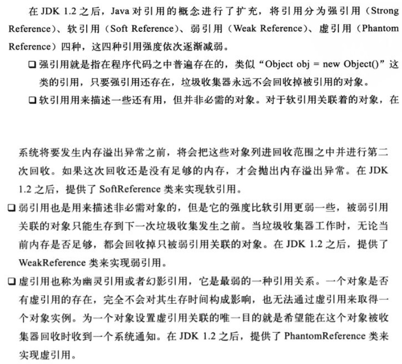

# 并发编程底层原理

## 进程、线程、纤程

- cpu只会不断从内存中进行指令拿取然后执行

- 三个线程按照顺序执行完就使用join即可

  

- synchronized是可重入锁

  - [可重入锁（递归锁） - 知乎 (zhihu.com)](https://zhuanlan.zhihu.com/p/285252463)

  ```java
  class A{
      public synchronized void m1(){
          m2();
      }
      
      public synchronized void m2(){
          
      }
  }
  //在m1中使用m2，用的是同一把锁，如果不是可重入锁，那么就会造成死锁。
  //可重入锁，就是如果在锁方法中调用另一个锁方法，两者如果用的是同一把锁，那么m2会自动获取到锁。
  ```

  - 可重入锁，指的是同一个线程外层函数获得锁之后，内层递归函数仍然能获取该锁的代码，在同一个线程在外层方法获取锁的时候，在进入内层方法会自动获取锁。

    也就是说，线程可以进入任何一个他已经拥有锁的所有同步代码块。

    synchronized 和 ReentrantLock 都是可重入锁。

  - synchronized为什么必须是可重入锁：因为如果父类P有一个锁方法，那么子类C重写这个方法，如果子类进行父类锁方法调用，如果synchronized不是可重入锁，那么就会直接死锁。（调用父类的方法不是父类对象在执行吗？你想你的父类进行了实例化吗，没有，所以调用调用者还是用的子类实例的数据，锁的还是子类实例）

- 异常锁：程序在执行过程中，如果出现异常，默认情况下锁是会被释放。所以在异常前面的代码中如果进行数据的处理，一定要小心异常后，别的线程对这部分数据的修改。

- synchronized的底层实现：

  - JDK早期:synchronized进行锁申请必须向OS进行申请
  - 后来改进：
  - [马士兵说：没错，我就是厕所所长！(二) - 哔哩哔哩 (bilibili.com)](https://www.bilibili.com/read/cv2846899/)
  - 每次上解锁都需要向OS进行申请，耗费时间和资源。
  - [Java并发——Synchronized关键字和锁升级，详细分析偏向锁和轻量级锁的升级_tongdanping的博客-CSDN博客_synchronized锁升级](https://blog.csdn.net/tongdanping/article/details/79647337)
  - 以下都是hotspot虚拟机的实现：
  - 无锁
  - 偏向锁（也叫无锁，主要是通过资源的头部标识位记录某个线程ID，将这个资源偏向某个线程，获得资源优先使用权），如果当一个线程获得这个对象的标识位那么这个资源的使用权，如果别的线程要用就需要修改标识位，修改前需要进行检测是否满足修改条件，满足就可以，不满足就会进入自旋锁状态。（JVM默认没有开启，如果要开启需要进行JVM参数配置）
  - 自旋锁（轻量级锁，不断请求锁检查资源是否可以使用，请求一次偏移量加一，默认旋10次结束就升级为synchronized）。
    - 使用场景，同步代码块执行时间短，且线程数目不多，因为本质就是一直在运行代码检测能否获得锁。
    - Java的原子类以及Lock的实现就是使用的自旋锁
  - 以上两者是使用执行代码的方法，使得在内存中解决资源的使用权问题。是在用户态进行解决
  - 重量级锁（synchronized）：直接将其他还在自旋的线程直接阻塞，当资源可用时就只有当前线程能够上锁。
    - 在OS层面进行干预，一旦某个线程上锁，其他线程进入ｗａｉｔ状态。
  - 锁只能升级不能降级
  - **偏向锁、自旋锁可以自己实现单独进行使用，而前两者也是对synchronized的优化流程，也就是说synchronized不是一来各个线程就在OS层面上锁了，而是在经历了上面两种状态后才会进行上锁**
  - **锁升级过程本质就是逐步提升线程的优先级过程**，通过提升优先级从而降低线程之间的竞争，优先级高的优先使用竞争到资源。
  - **[无锁 VS 偏向锁 VS 轻量级锁 VS 重量级锁 - 简书 (jianshu.com)](https://www.jianshu.com/p/e78fd728ad44)）**
    - 将这个讲的很透彻，主要就是修改对象头标识位以及检查进行获取资源使用权，哪怕最后重量级锁也只是进行修改，但是OS是参与调整竞争，一旦有一个线程通过synchronized获取到对象使用权，那么其他线程就进入阻塞。

## volatile

- 保证线程工作内存可见性：

  - 线程在工作内存修改了某个公共数据，会立即将数据同步到主内存中
  - 但是其他线程中却不能确定什么时候会重新从主内存中将数据进行读取，所以修改了的值对其他线程不可见
  - 如果加上volatile那么其他线程就会立即去主内存中进行读取
  - 在底层volatile依赖于MESI协议（Intel 的cpu缓存一致性协议）。为什么，因为volatile是在JVM层的概念，而程序的所有代码最终都是在OS上执行，JVM对于其而言仅仅是一个用户内存区。在多核CPU中，每个CPU都有自己的缓存（3级缓存），那么最终多线程是可能在不同CPU上执行，那么数据也同样会在CPU缓存中，如果没有解决这个缓存一致性，那么必然无法保证volatile的工作内存可见性。
  - **volatile具有有限制的级联可见性,比如用volatile修饰对象引用,并且给定线程休眠时间,那么其属性修改也能够有可见性,在休眠时间将值进行了更新**
  - **volatile不要用来修饰引用值,按理说volatile只能保证引用地址的可见性,无法保证堆内存对象实体的修改中的可见性,但是有时候又有特殊性**
- 禁止指令重排序

  - 现在OS是进行并发执行指令，所以会对执行指令进行重排序
- **为什么synchronized为什么不能禁止指令重排序，却能够保证有序性**
  - **synchronized通过排他锁的方式就保证了同一时间内，被synchronized修饰的代码是单线程执行的。所以呢，这就满足了as-if-serial语义的一个关键前提，那就是单线程，因为有as-if-serial语义保证，单线程的有序性就天然存在了。**
    - **虽然很多硬件都会为了优化做一些重排，但是在Java中，不管怎么排序，都不能影响单线程程序的执行结果。这就是as-if-serial语义，所有硬件优化的前提都是必须遵守as-if-serial语义。**
  - **为什么不能禁止指令重排序？**
    - **Java中唯一能够禁止指令重排只有volatile，它通过加入内存屏障指令实现禁止。synchronized仅仅是因为排他锁的性质使得单线程执行而满足as-if-serial规则而保证同步代码有序性，``当Javach进行编译时可能为了在执行引擎上运行在编译源码为class指令进行优化而重排序，而JVM执行引擎在编译class字节码为OS指令时，很可能会进行优化而指令重排序。``**
  - **synchronized根本不能禁止指令重排序，所以在DCL中很可能因为JVM的执行引擎优化导致先返回内存地址在进行内存初始化，从而当新的线程来临时，进行外层if判断发现不为空就直接拿着未初始化的对象进行使用。所以必须加volatile**
- synchronized优化
  - 细化：就是尽量锁的粒度细
  - 粗化：在同一业务逻辑上，细化的锁加的太多了，不如加一把大锁，减少线程之间的竞争而耗费的CPU、内存资源
  - 注意：锁的对象，如果锁对象的属性发生改变，不会产生问题，但是如果锁对象的引用发生改变就会发生问题，因为已经换锁了，如果不停的换，相当于就没加锁。所以锁对象最好加上**final**
  - **当方法wait()被执行后，锁自动被释放，但执行完notify()方法后，锁不会自动释放。必须执行完notify()方法所在的synchronized代码块后才释放。**

## CAS

- Compare And Swap(比较与交换)，1.7以后使用的Compare And Set

- 又叫**无锁优化、自旋、乐观锁.....注意不是无锁**

- 在Java中自己实现了一些常用需要进行加锁的原子（atomic）操作类，这些类自动带锁，但是这些锁并不是synchronized进行实现的，而是CAS进行实现的，保证线程安全的。号称无锁。**外层使用的是do while,自旋锁的实现思路**

- 所有这些类最终的会区调用Unsafe类的方法cas(v,expected,newValue)

  ```java
  //compare and set，比较并设置，CPU原语支持
  cas(v,e,new){//v是当前从内存中取到的值，e是期望值，new是新值
      if v==e
         v=new
    
  }
    如果当前值和期望值相同，那么就修改，如果不同就不设置，然后再次回到外层检测再次执行，这个操作因为是调用CPU原语，这条原语是原子操作
  ```

  

- [为什么CAS加锁是线程安全的？——原子操作底层原理 - codespoon - 博客园 (cnblogs.com)](https://www.cnblogs.com/codespoon/p/13462765.html)

- ABA问题：

  - 在CAS中：就是当前线程从线程中取到了一个值A，且期望的值也是A，但实际上A可能被其他线程修改过多次最终变为A，让你误以为是期望的A。如果这个改变对逻辑上没有影响，那么我们可以不用管。**比如对于基本类型是没有影响的，基本类型无非就是对于单块的内存中的值的修改，它的逻辑始终就只是在原来的值上进行修改`注意一点就是CAS在底层操作内存是原子的，且操作完后其他缓存失效，重新获取最新值，当别的线程进行同样的验证时，会发现值和预期的不一样，所以是不会出现别的线程也是同样的操作从而导致值被多加或者是少加或者是被设置多次`，一句话操作在底层是单线程且内存可见的，值得最终结果不会变化**
    - **在对象引用场景还有一种情形，就是A引用没有变但是其内部引用属性已经被修改，ABA究竟有没有影响更多的还是看你的应用场景**，就会出现问题，常常是有引用链的场景，就是使用引用来判定是否交换，从而导致引用链被破坏。比如像用Integer对象来组成一个栈，然后增删对象，虽然是通过值进行判定但是却是操作的引用，使得整个引用链断裂，就像C中的指针乱串问题。
    - [Java CAS ABA问题发生的场景分析 - 木易森林 - 博客园 (cnblogs.com)](https://www.cnblogs.com/senlinyang/p/7875381.html)
    - 解决ABA问题：就是通过加版本号，每次比较的时候还要进行版本号比较，如果版本号已经修改，你还要不要进行修改就看你
  
- 原子类内部实现使用的Unsafe类

  - 这个类是单例的，可以通过反射或者获取方法进行使用。
  - 这个类就是用来直接操作内存的类，你可以将其理解为C中的指针，也就是你可通过这个类对内存任意操作，比如访问修改对象内存的属性，开辟空间....（new delete）
  - 四类操作

  - 直接操作内存
  - 直接生成类实例
  - 直接操作类或者实例变量
  - CAS操作

## LongAdder

- synchronized、CAS、LongAdder在某些测试点的效率点不同，在线程并发非常高时Long Adder执行累加的的效率往往最高

  - **`AtomicLong`是通过无限循环不停的采取CAS的方法去设置内部的value，直到成功为止。那么当并发数比较多或出现更新热点时，就会导致CAS的失败机率变高，重试次数更多，越多的线程重试，CAS失败的机率越高，形成恶性循环，从而降低了效率。**

  - 为什么LongAdder效率比CAS还要高因为它使用了**分段锁**
    - 就是通过维护一个数组，每个元素都维护一个值，将并发线程分摊到这些元素上，这些线程对单个元素进行CAS操作，最后将所有元素的值进行累加起来得到最终的值。
    - 简单的说就是将CAS上对一个资源的操作大量并发变为对多个资源上的小并发，最后再将结果累计得到最终结果。
    - **其实就是分治法的思想**

- [LongAdder解析 - 知乎 (zhihu.com)](https://zhuanlan.zhihu.com/p/60106083)

## ReentrantLock

- 与synchronized的异同点：

  - 两者都是可重入锁

  - 改锁必须要在finally中手动解锁，如果发生异常是不会自动解锁的，但是synchronized不是。
  - reentrantlock可以尝试进行获取锁：
    - tryLock(时间数值，时间单位);
    - 尝试在一定时间内等待这把锁，时间到后返回一个Boolean值，你可以自行选择下面的操作。
    - 也就是可以自定时间CAS，而不是synchronized需要经过锁升级

- lock 与 lockInterruptibly比较区别在于：
  lock 优先考虑获取锁，待获取锁成功后，才响应中断。
  lockInterruptibly 优先考虑响应中断，而不是响应锁的普通获取或重入获取。

  详细区别：

  ReentrantLock.lockInterruptibly允许在等待时由其它线程调用等待线程的Thread.interrupt方法来中断等待线程的等待而直接返回，这时不用获取锁，而会抛出一个InterruptedException。 ReentrantLock.lock方法不允许Thread.interrupt中断,即使检测到Thread.isInterrupted,一样会继续尝试获取锁，失败则继续休眠。只是在最后获取锁成功后再把当前线程置为interrupted状态,然后再中断线程。

  - **就是说lockInterruptibly可以使得我们可以自主的通过某些条件进行打断，而lock不拿到锁就不会响应interrupt，避免死等。**

- **ReentrantLock与Condition的实现原理是创建等待队列,一个Condition对象对应一个队列,等待时将线程放在不同的等待队列,唤醒时就唤醒指定队列就行** 

- 公平锁会获取锁时会判断阻塞队列里是否有线程再等待，若有获取锁就会失败，并且会加入阻塞队列

  非公平锁获取锁时不会判断阻塞队列是否有线程再等待，所以对于已经在等待的线程来说是不公平的，但如果是因为其它原因没有竞争到锁，它也会加入阻塞队列

  进入阻塞队列的线程，竞争锁时都是公平的，应为队列为先进先出（FIFO）

  - 也就是由阻塞队列进行管理，而不是锁对象本身维护一个队列
  - 公平锁是按照队列进行调用，至于进入队列这期间是不是公平的它也不能保证。

- 可重入锁：

  - **在线程获取锁的时候，如果已经获取锁的线程是当前线程的话则直接再次获取成功**

    **由于锁会被获取n次，那么只有锁在被释放同样的n次之后，该锁才算是完全释放成功**

- Lock底层使用的是cas

## Phaser

- 移相器
- [Java线程--Phaser使用 - 前往幸福的路上 - 博客园 (cnblogs.com)](https://www.cnblogs.com/fanerwei222/p/11867895.html)

- 就是会移位的屏障

  - 可以继承重写该类的onAdvance方法，改方法中可以用switch定义多个阶段终点的标识，可以执行也可以啥都不做

  - 动态表明参加阶段的线程数目，调用一次phaser.register，phaser就知道要该阶段要等待线程的数目加一。
  - 线程的run()的运行逻辑通过phaser.arriveAndAwaitAdvance()来进行代码执行阶段划分，只有当注册数目的线程=arriveAndAwaitAdvance()调用次数时，phaser才会执行onAdvance()方法，执行阶段定义好的终点逻辑。
  - 有的线程只会参加某个阶段，如果不参加了就需要调用arriveAndDeregister()，调用一次，phaser就知道下阶段需要等待的线程数目需要-1

- 这个类对于考试、比赛这种场景很有用。

- 遗传算法

## ReadWriteLock

- ReentrantLock每次读写都会上排他锁，所以效率不高，于是希望读写分别加锁，读锁可以共存，写锁就是排他锁只能上一把,其他任何锁都不能存在.

## semaphore

- 信号量,表示资源数目,**用于限制某段时间,并发线程的数目**,它可以用来做锁,它的目的不是用来存储数据,但是同样需要考虑并发问题
  - 你可以采用int和锁自己实现,Java只是给你封装了起来
- 限流,(车道通行)其他拿不到资源的就只能等待
- 它主要目的不是用来保证保证线程访问数据的同步问题,那是锁干的事,但是它可以做锁.
- 它的取值策略有公平策略和非公平策略(就是线程拿锁是排队抢还是抢占式一样的概念)
- 它底层实现仍然是维护了一个队列,可以将没有获得通行标识的线程进行排队.

## Exchanger

- 用于两个线程之间交换数据

## LockSupport

- LockSupport.park():让当前线程进入阻塞
- LockSupport.unpark(t):唤醒指定线程
- unpark(t)可以先于park()调用,使得park()失效

## AQS（AbstractQueuedSychronized）

- 抽象队列的同步器

- **[Java 中的 AQS 到底是什么？高级面试必问！_emprere的博客-CSDN博客](https://blog.csdn.net/emprere/article/details/109172564)**

- [AQS 如何使用 - 知乎 (zhihu.com)](https://zhuanlan.zhihu.com/p/40025595)

- 这是JUC里的同步组件主要实现原理

- [AbstractQueuedSynchronizer同步队列与Condition等待队列协同机制_华仔的逆袭的专栏-CSDN博客_aqs同步队列与等待队列区别](https://blog.csdn.net/tb3039450/article/details/69056169)

- [并发编程——详解 AQS CLH 锁_u012501054的博客-CSDN博客](https://blog.csdn.net/u012501054/article/details/100991055?utm_medium=distribute.pc_aggpage_search_result.none-task-blog-2~aggregatepage~first_rank_ecpm_v1~rank_v31_ecpm-1-100991055.pc_agg_new_rank&utm_term=AQS的clh的不一样之处&spm=1000.2123.3001.4430)

- AQS是CLH同步锁的一种变形或者说是优化

  >> CLH CLH(Craig, Landin, and Hagersten locks): 是一个自旋锁，能确保无饥饿性，提供先来先服务的公平性。
  >
  >> CLH锁也是一种基于链表的可扩展、高性能、公平的自旋锁，申请线程只在本地变量上自旋，它不断轮询前驱的状态，如果发现前驱释放了锁就结束自旋。

  - **也就是说CLH是一种基于由链表实现同步队列的自旋锁，排队策略是FIFO策略**

  - **为什么说AQS实现是使用volatile和CAS？**

    - 其一，属性state：（**volatile** int state），其本质就是信号量的意义，我们早就说过信号量可以实现锁。
      - 该属性根据不同的子类取不同的意义，如reentrantlock就是能否上锁的标识，countdownlatch就是开门的标识，cyclicbarrier就是放行标识，semaphore就是信号量
    - 其二：transient **volatile** Node tail（链表的尾部节点），这个节点的属性也都是使用volatile进行修饰的。
      - **该队列的特点：双向链表、保存的值是线程的引用**

  - ReentrantLock实现的逻辑：

    - **尝试tyrAquire()获取锁-通过state判断是否可以拿到锁，如果能够就通过CAS（`具体调用的就是compareAndSetState()，其底层使用还是CAS`）的方式进行修改state，如果修改成功就将其设置为排他锁，如果是该线程在重复的获取锁就将state+1**

    - **如果没有获取这个锁进入进入同步队列排队，在尾部进行添加，添加时还是采用CAS的方式进行添加，因为添加也是一个多线程并发点**

      ****

- **可重入锁加多少次锁就要释放多少次锁，synchronized是自动加放锁，所以我们平常没有注意，但是lock我们要注意，反正lock与unlock要成对出现**

- 同步队列和阻塞队列

  - 同步队列，就是一个自旋队列不断检测是否能否获取锁
  - 等待队列，就是自旋队列的节点旋转超过一定的时间就进入等待队列。我们知道线程的等待和唤醒都需要极大的代价


## 线程调优

- 是不是线程越多，吞吐量越高？

  - 计算机的每个cpu上只能执行一个线程

  - 线程之间需要不断的切换。每次切换都需要OS进行参与，OS的参与意味着需要从线程的用户台转换为内核态，（OS主要的作用就是将线程的执行现场进行保存）。
  - 如果线程过多，那么每个线程执行的时间就会越短，且过多的资源都会耗费在OS切换过程。

- 既然单核只能运行一个线程，对于单核多线程还有意义吗？

  - 肯定有意义
  - 因为计算机的操作分为两种：要么是用cpu进行计算，要么就是在进行数据的IO（如磁盘、网络、鼠标、键盘、显卡、U盘.....），因为现在计算机模型是以存储式为核心的（内存），外部IO与内存的交互交由DMA通道托管，cpu不用参与，那么进行IO的时间cpu实际是空闲的。所以这段时间cpu的计算可以切换给别的线程进行使用。
  
- **计算任务需要多少线程适合？（线程池的数量设计多少合适）**

  - $$
    Num_{线程}=Num_{cpu}*U_{cpu}*(1+W/C)
    \\
    线程数=cpu数×cpu利用率×（1+空闲时间比率/计算时间比率）
    $$

    

  - 怎么理解这个公式：

    - cpu数×cpu利用率；得到的就是我们实际上可以使用cpu数目
    - W平均每条线程的cpu等待时间，C平均每条线程cpu执行时间
    - 1+W/C=(W+C)/C;就是cpu所有时间用来执行命令可以执行的线程数目
    - **最后将所有乘起来：就是cpu数目乘以每个cpu可执行线程数目=总线程数**

  - **注意实际上还应该考虑OS切换时间，其他线程等等，这个公式仅仅是学术上的大致的估计，工程不适用**

  - **`究竟怎么得到这个线程数目？`**

    >**通过压测**
    >
    >就是通过发送一定数量的并发请求，然后进行性能监测，如果能够达到要求就停止，如果不能就调整参数，进行不断的统计，得到最适合点

## 线程调度算法

- Linux:CFS(完全公平算法)

## 对象在Java内存中布局

- 对象头：
  - markword:标记字
  - class pointer:类型指针
- 实例数据：instance data
  - 就是对象的属性
- 填充字节：
  - padding
- synchronized
  - 先修改对象头部信息
- JOL（Java对象布局插件）
- [关于 锁的四种状态与锁升级过程 图文详解 - 牧小农 - 博客园 (cnblogs.com)](https://www.cnblogs.com/mingyueyy/p/13054296.html)


## Java中的引用类型

- [只有马士兵老师能把ThreadLocal底层原理、内存泄漏分析的这么测透_哔哩哔哩_bilibili](https://www.bilibili.com/video/BV1fA411b7SX?spm_id_from=333.337.search-card.all.click)

  

### 强引用

- 使用new进行创建对象，这个对象的引用就是强引用，准确的说就是引用直接指向对象实体。只要有线程的工作内存中有直接指向对象内存的变量，那么就算内存溢出，这个对象也不会被回收。

  ```java
  Object o=new Object();//这个o就是强引用，只有这个o不引用这个对象在堆内存中的实体时，这块内存区域才会被回收。
  o=null;
  System.gc();//显示调用GC，回收内存，一旦某个对象内存被回收就会去调用finalize（）
  ```

  

- 问题：[**OOM 和 FGC异常排查 - 简书 (jianshu.com)**](https://www.jianshu.com/p/0a902891ed81)

  ```tex
  为什么c++程序员会调用finalize方法？
  ==因为这个方法在内存回收前会被自动调用相当于C++中的destroy().所以会在里面进行一些资源释放
  为什么重写finalize会频繁造成FGC（全部垃圾回收）和OOM？
  ==因为在finalize中使用大量的长时间操作，使得对象内存回收慢，如果系统产生新生对象比较快，使得jvm尝试FGC，在FGC后还无法满足只能抛出OOM。
  ```
  
  

###软引用

- 就是用一个引用指向另一个引用。就是C++中，如果你创建了一个对象，用一个指针指向这个内存地址。我们再创建一个指针指向前面的指针的内存。这个指针就是软引用。

- 理解就用桌面快捷方式

  ```java
  //Java中时没有指针的概念，且对象之间的赋值是引用传递而不是值传递，所以普通的赋值方法是没有办法创建软引用的
  //Java反射包中提供了软引用
  //创建一个1K内存空间
  SoftReference<byte[]>m=new SoftReference<byte[]>(new byte[1024]);
  ```

  
  
- 具体就是SoftReference中含有一个引用，这个引用指向对象实体。从内存结构看，这个引用是存在在堆内存中的，而new返回的引用变量是存在栈中。

- 特点：当内存足够时，不会回收，当内存空间不够时，这个引用指向的对象实体会被回收。

- 用处：做缓存。内存够自己呆着，不够就被回收。

### 弱引用

```java
WeakReference<>w=new WeakReference<>(new Object());
sout(w.get());
Sysytem.gc(w);
sout(w.get());//垃圾回收调用后直接就被回收了，感觉和没有人指向一样。
```


### 虚引用

- **[虚引用真的不影响对象的生命周期吗？99%的人都错了 - 知乎 (zhihu.com)](https://zhuanlan.zhihu.com/p/306795513)**
- **[设计WeakReference的那段日子 (qq.com)](https://mp.weixin.qq.com/s/cShzxZVOsD50LZJgu-jJwQ)**

- [你不可不知的Java引用类型之——虚引用 - 弗兰克的猫 - 博客园 (cnblogs.com)](https://www.cnblogs.com/mfrank/p/9837070.html)

```java
PhantomReference<> phantomReference=new PhantomReference(new Object(),QUEUE);
```

- phantomReference逻辑上的两个身份：指向PhantomReference实体的强引用，指向Object的虚引用。
  - 具体回收过程：
    - 当GC进行回收时，发现这个对象可达性是虚的，将这个对象的虚引用（phantomReference）加入引用队列。并且会执行finalize方法。这个时候对象并不会被回收。
    - 当GC清除引用队列时或者程序员自己处理这个队列时才会对这个对象进行回收。（所以我们可以虚引用来控制一个对象究竟什么时候被回收。）1.8是它会将引用队列中的对象状态设置为活跃，所以GC不会进行彻底回收。1.9之后采取一定的策略，处理没有处理的对象。
    - **注意弱引用虽然会被加入队列，但是会直接被GC处理掉**
- 作用：
  - 跟踪内存
  - 管理直接内存（NIO中提出了，不在JVM的用户区开辟缓存，直接在内核区中开辟一个缓存区，OS直接往里面存，JVM的线程直接使用，开辟的代价极大，效率极高，不受GC的管理。这个内存究竟怎么管理怎么用，需要仔细考虑）


## ThreadLocal


# 简历中最值钱的技术！！！！！！！

- 互联网三高

  - 高性能

    - 高并发（高吞吐）：算法和处理模型（QPS）
    - 低延时（处理时间，低延时可提高并发）：算法，硬件
    - **这两者其实在一定程度上是相互影响的，如果一个不能将吞吐量合理的分配，很可能导致硬件层面延时，从而导致整体低延时**

    - **调性能的方法：**
      - 降低响应时间（重点，很难）
        - 阿默达尔定律
      - 提高吞吐量（容易点，实际采取点）

  - **高可用：这个是一个架构的基础点也是重点**

    －**服务不能轻易死掉、故障移除**

    - [你们系统是怎么保证高可用的 - 知乎 (zhihu.com)](https://zhuanlan.zhihu.com/p/88398621)

  - 高扩展

    －**系统的弹性、扩展吞吐量、功能增强**

    - 上面两点一般采用分布式集群，主要就是**架构设计**

- 优化（单机性能、集群性能）**就优化吞吐量、响应时间，再具体点就是微观算法、宏观模型架构**
  - 业务复杂度优化：**技术赋能业务**（就是用技术优化你的业务----P7）
    - 改变业务的执行模型、流程、执行细节（调整业务架构）
    - 比如同步模型转变为异步模型（MQ、Tomcat、IO模型）－－－－优化响应时间
    - 集群化处理：优化吞吐量
    - 负载均衡：吞吐量、响应时间
    - 分库分表：响应时间、吞吐量
    - JVM优化：响应时间
    - 热点数据、多级缓存：响应时间
    - 动静分离：响应时间
    - CDN：响应时间和吞吐量
    - 锁优化：响应时间
    - 减少IO操作：响应时间
    - 熔断、降级、限流：吞吐量

