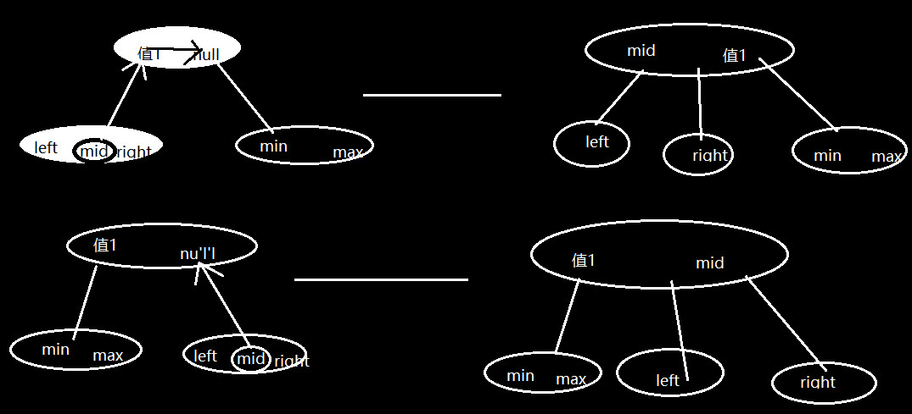
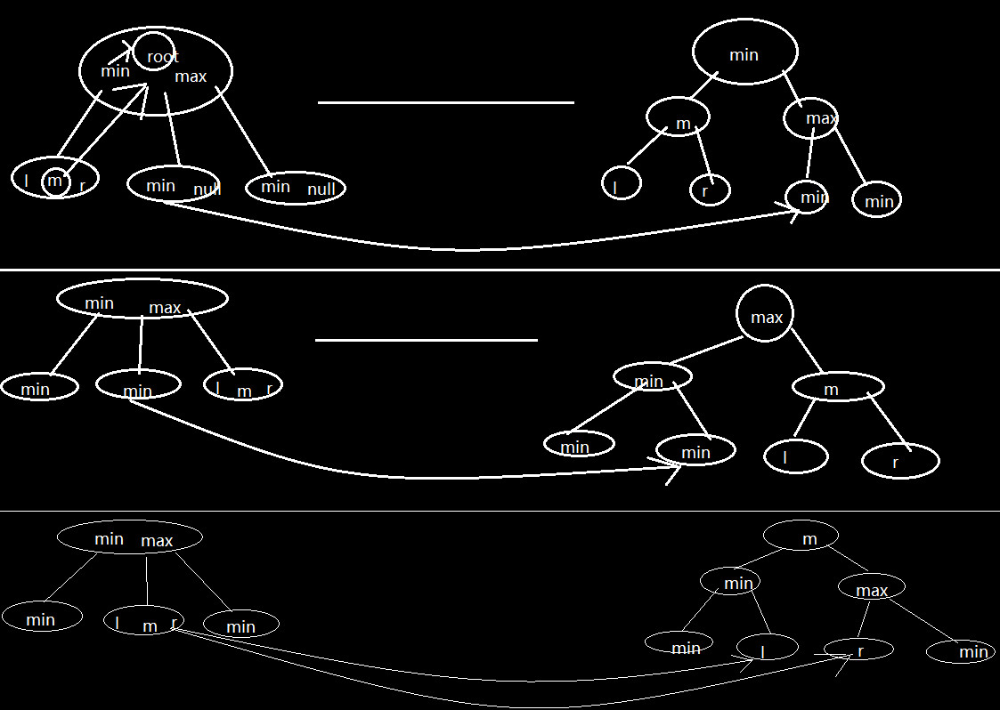

# 算法积累

## 1、基本算法

### 1.1八大排序

- [常见排序算法总结分析之选择排序与归并排序-C#实现 - iwiniwin - 博客园 (cnblogs.com)](https://www.cnblogs.com/iwiniwin/p/12609549.html)
- 排序是计算机内经常进行的一种操作，其目的是将一组“无序”的记录序列调整为“有序”的记录序列。
- 内部排序和外部排序：
  若整个排序过程不需要访问外存便能完成，则称此类排序问题为内部排序；
  反之，若参加排序的记录数量很大，整个序列的排序过程不可能在内存中完成，则称此类排序问题为外部排序。
  内部排序的过程是一个逐步扩大记录的有序序列长度的过程。
  内排序的方法有许多种，按所用策略不同，可归纳为五类：插入排序、选择排序、交换排序、归并排序和分配排序（分块排序）。
  其中，插入排序主要包括直接插入排序和希尔排序两种；选择排序主要包括直接选择排序和堆排序；交换排序主要包括气（冒）泡排序和快速排序。
- 一、冒泡排序
  已知一组无序数据a[1]、a[2]、……a[n]，需将其按升序排列。首先比较a[1]与a[2]的值，若a[1]大于a[2]则交换两者的值，否则不变。再比较a[2]与a[3]的值，若a[2]大于a[3]则交换两者的值，否则不变。再比较a[3]与a[4]，以此类推，最后比较a[n-1]与a[n]的值。这样处理一轮后，a[n]的值一定是这组数据中最大的。再对a[1]~a[n-1]以相同方法处理一轮，则a[n-1]的值一定是a[1]~a[n-1]中最大的。再对a[1]~a[n-2]以相同方法处理一轮，以此类推。共处理n-1轮后a[1]、a[2]、……a[n]就以升序排列了。
  优点：稳定，比较次数已知；
  缺点：慢，每次只能移动相邻两个数据，移动数据的次数多。
- 二、选择排序
  已知一组无序数据a[1]、a[2]、……a[n]，需将其按升序排列。首先比较a[1]与a[2]的值，若a[1]大于a[2]则交换两者的值，否则不变。再比较a[1]与a[3]的值，若a[1]大于a[3]则交换两者的值，否则不变。再比较a[1]与a[4]，以此类推，最后比较a[1]与a[n]的值。这样处理一轮后，a[1]的值一定是这组数据中最小的。再将a[2]与a[3]~a[n]以相同方法比较一轮，则a[2]的值一定是a[2]~a[n]中最小的。再将a[3]与a[4]~a[n]以相同方法比较一轮，以此类推。共处理n-1轮后a[1]、a[2]、……a[n]就以升序排列了。
  优点：稳定，比较次数与冒泡排序一样；
  缺点：相对之下还是慢。
- 三、插入排序
  已知一组升序排列数据a[1]、a[2]、……a[n]，一组无序数据b[1]、b[2]、……b[m]，需将二者合并成一个升序数列。首先比较b[1]与a[1]的值，若b[1]大于a[1]，则跳过，比较b[1]与a[2]的值，若b[1]仍然大于a[2]，则继续跳过，直到b[1]小于a数组中某一数据a[x]，则将a[x]~a[n]分别向后移动一位，将b[1]插入到原来a[x]的位置这就完成了b[1]的插入。b[2]~b[m]用相同方法插入。（若无数组a，可将b[1]当作n=1的数组a）
  优点：稳定，快；
  缺点：比较次数不一定，比较次数越少，插入点后的数据移动越多，特别是当数据总量庞大的时候，但用链表可以解决这个问题。
- 四、缩小增量排序
  由希尔在1959年提出，又称希尔排序(shell排序)。
  已知一组无序数据a[1]、a[2]、……a[n]，需将其按升序排列。发现当n不大时，插入排序的效果很好。首先取一增量d(d<n)，将a[1]、a[1+d]、a[1+2d]……列为第一组，a[2]、a[2+d]、a[2+2d]……列为第二组……，a[d]、a[2d]、a[3d]……列为最后一组以次类推，在各组内用插入排序，然后取d'<d，重复上述操作，直到d=1。
  优点：快，数据移动少；
  缺点：不稳定，d的取值是多少，应取多少个不同的值，都无法确切知道，只能凭经验来取。
- 五、快速排序
  快速排序是冒泡排序的改进版，是目前已知的最快的排序方法。
  已知一组无序数据a[1]、a[2]、……a[n]，需将其按升序排列。首先任取数据a[x]作为基准。比较a[x]与其它数据并排序，使a[x]排在数据的第k位，并且使a[1]~a[k-1]中的每一个数据<a[x]，a[k+1]~a[n]中的每一个数据>a[x]，然后采用分治的策略分别对a[1]~a[k-1]和a[k+1]~a[n]两组数据进行快速排序。
  优点：极快，数据移动少；
  缺点：不稳定。
- 六、箱排序（桶排序）
  已知一组无序正整数数据a[1]、a[2]、……a[n]，需将其按升序排列。首先定义一个数组x[m],且m>=a[1]、a[2]、……a[n]，接着循环n次，每次x[a]++.
  优点：快，效率达到O(1)
  缺点：数据范围必须为正整数并且比较小
- 七、基数排序
- 八、计数排序

### 1.2三大查找


### 1.5 素数

- [几种素数判定方法_Geek-Tuzki-CSDN博客_素数判定定理](https://blog.csdn.net/yyyds/article/details/51729858)

- [判断素数的5种方法-百度经验 (baidu.com)](https://jingyan.baidu.com/article/59a015e3f747d8b7948865e4.html)

- [质数表_百度百科 (baidu.com)](https://baike.baidu.com/item/质数表/7085686?fr=aladdin)

- [素数筛选法(埃氏筛 欧拉筛)_CodeBugZero的博客-CSDN博客](https://blog.csdn.net/weixin_46211066/article/details/121159262)[这个用于快速判断素数的个数，或者得到一定范围内的所有素数。如果要使用这种方法准确的确定一个数是不是素数，可以先确定所有的素数，然后采用查找或者直接下标定位进行确定。]

  ```python
  #蛮力法
  for i in range(2,100,1):
  	m=True
  	for j in range(2,i,1):
  		if i%j==0:
  			m=False
  			break
  	if m:
  		print(i,"-",end="")
  #减治法-减常量
  import math
  for i in range(2,100,1):
  	#循环到平方根结束(因为将非素数分解后两个因子一个大于平方根一个小于平方根)
  	flag=True
  	for j in range(2,math.floor(math.sqrt(i))+1,1):
  		if i%j==0:
  			flag=False
  			break;
  	if flag:
  		print(i,"-",end="")
          
  #定理：“若正整数a>1,且a不能被不超过a的平方根的任一素数整除，则a是素数”
  #那么我们可以将验证到平方根的每个数改为验证到平方根的每个素数
  #我们可以可以称之为减可变规模
  #法一：可以选择将找出所有的素数存储起来然后遍历取值验证
  #法二：从7开始，素数之间存在一个规律，规律如下
  #2 3 5 7 11 13 17 19 23 29 31 37 41 43 47 53 59 61 67 71 73 79 83 89 97 101
  #	    4  2  4  2  4  6  2  6  4  2  4  6  6  2  6  4  2  6  4  6  8  4
  #	    					   |		2  4        |	  4  2     2 6|
  #也就是素数之间【4  2  4  2  4  6  2  6 】形成一个循环，只要从7开始每次按此规律加数，
  #那么只要到x的平方根结束，就能够保证这中间的素数都会被遍历一遍
  #两种方式第一种适合长期频繁的素数判断操作，第二种适合临时判断，不需要知道期间具体的素数
  #实现第二种
  #判断是否是函数
  def isPrime(x):
  	list=[4,2,4,2,4,6,2,6]
  	if x==2 or x==3 or x==5 :
  		return True
  	#求出平方根
  	q=math.floor(math.sqrt(x))
  	#python中step=-1就代表不增长，如果不写默认为1
  	#先验证2，3，5
  	if x%2==0 or x%3==0 or x%5==0:
  		return False 
  	for temp in range(7,q+1,1):
  		for i in range(0,8,1):
  			#如果有素数能够整除就不是素数
  			if x%temp==0:
  				return False
  			temp+=list[i]
  		if x%temp==0:
  			return False
  	return True
  for x in range(2,100,1):
  	if isPrime(x):
  		print(x,"-",end="")
  print()
          
  ```

- 埃氏筛选，就是每次确定一个数是素数就将其整数倍进行删除。

- 欧氏筛选的理解

  - [素数的个数之欧式筛法_哔哩哔哩_bilibili](https://www.bilibili.com/video/BV1WE411N7a1?from=search&seid=1956311553329807548&spm_id_from=333.337.0.0)

  - 因为采用埃氏会进行大量的重复筛选，尽管是nloglogn。

    因为一个合数必然能够分解为一个**质数×一个数**,所以如果只使用最小质因数进行筛选就能够避免重复筛选。欧氏筛选的目的就是找到一个数的最小质因数然后进行筛选。

    ```tex
    假设一个数：
    i=p*q(p是i的最小质因子)
    若q是合数，则：
    q=x*y,x是一个质数，且x>p
    i=p*q
     =p(x*y)
     =x*(py)
     =x*z	(x>p)
     所以一个合数z乘一个质数x,可以表示为一个更大的合数q乘一个更小的质数p
    
    ```

  - 将找到的素数单独存储到prime[]，使用索引i从1到n，如果是素数就添加到prime[]。使用索引i乘prime[]中所有的素数并标识为合数。

  - 但是有个问题：扫描到4的时候，12该不该标识，不该，因为是要使用最小质因子进行筛选。标识时应该是使用2*6。但是我们应该用什么条件确定该不该标识？

  - 想想为什么会这样？因为4是一个合数，且分解2×2(由定理-一个合数的因子必然一个小于其平方根，一个大于其平方根。)，所以如果当前的合数能够在遍历质数相乘时，发现这个质数能成为自己的因子，那么如果还剩余质数的话，就不用相乘了，因为它们的乘积能转换为比剩余质数还要小的质数与比当前i更大的数相乘，那么后续自然会有更大的数乘最小质因数进行标识。所以每次i遍历质数时，都需要%判断是不是最小质因数，是就直接退出，不是就接着循环。

    ```python
    #使用欧氏筛选法筛选一定范围内的素数
    
    def euclid(n):
    	#定义一个prime[]存储素数
    	prime=[]
    	#定义一个bool[]用于标识
    	flag=[]
    	#初始化flag
    	for i in range(0,n+1,1):
    		flag.append(True)
    	#开始遍历
    	for x in range(2,n+1,1):
    		#判断是否是素数
    		if flag[x]==True:
    			prime.append(x)
    		#将当前索引依次与素数相乘
    		j=0;
    		while j<len(prime) and x*prime[j]<=n:
    			#标识合数
    			flag[x*prime[j]]=False
    			#如果这个索引能够进行分解出当前质数就直接退出
    			if x%prime[j]==0:
    				break
    			#不是就接着加一
    			j+=1
    	#打印素数
    	for x in prime:
    		print(x,"-",end="")
    #调用
    euclid(100)
    ```


### 1.6 傅里叶思想

- 函数四大性质：对称性、奇偶性、单调性、周期性
- [傅里叶变换思想 - 百度文库 (baidu.com)](https://wenku.baidu.com/view/9c2231a3f111f18582d05a2a.html)
- [傅里叶分析之掐死教程（完整版）更新于2014.06.06 - 知乎 (zhihu.com)](https://zhuanlan.zhihu.com/p/19763358)


### 1.7 动态规划之图像压缩算法

- [10_动态规划之图像压缩_算法设计与分析_哔哩哔哩_bilibili](https://www.bilibili.com/video/BV1Sk4y1B7HF?spm_id_from=333.999.0.0)
- 常用图片格式其实都是进行压缩了的，比如JPEG是一种无损压缩。

- 我们知道图片就是一个个的像素，这些像素组合起来形成我们肉眼中的图像。那么我们只需要用像素矩阵将整个二维图片的每个像素值存储起来就行。
- 图像压缩的目的就是减少图片存储以及传输的开销。
- 前提知识：我们需要知道图片的分辨率，因为确定单位长度有多少个像素，那么由此我们就知道像素矩阵的大小。然后我们需要知道像素采用的格式，比如是不是RGB格式，这样我们就能够确定单个像素需要多少空间进行存储。比如RGB（0-255），恰好每个颜色值为8位即是一个字节，所以一个像素我们需要使用3个字节进行存储。

## 2、Hash算法

### Hash散列表

```tex
散列表（Hash Table），也就是我们常说的哈希表，散列表利用数组的随机存取的特点。思想是：将数据与数组的下标一一映射起来。从而达到快速存取的目的。实践复杂度为O（1）。
```

### 散列函数（Hash函数）

```tex
就是将数据与数组下标一一对应起来的具体算法。可以叫做一个hash算法或者函数。换句话说我们可以直接用数学上的二维函数映射进行说明。就是我们数学上的一一对应：如y=x,y=x^2
https://www.bilibili.com/video/BV1za411F76U?from=search&seid=16748108615259111441&spm_id_from=333.337.0.0
是否能够找到唯一确定的函数进行映射数据，我们知道高次多项式存在一个性质，假设多项式的最高次数为d，那么有d+1个点能够唯一确定这个多项式。所以如果我们能够假设一个d次多项式，并确定d+1个点，计算出系数。然后每次存取时，就进行计算。但是这个点如何取比较合适？
```


```tex
1、hash存在不可避免的问题，hash碰撞（在这个基础上衍生出挤兑循环问题，比如布谷鸟过滤器的算法问题。）比如MD5算法也存在该问题，但是我们可以控制数据的数量从而保证算法能够正确的运行。所以hash算法一般都有空间利用率以及数据正常存取的一个界限。要找到一个不会产生冲突的函数往往需要大代价。
2、解决函数冲突的两种方法：
	-探测（线性寻址、开放寻址）
   （
   	开放寻址：开放寻址法的核心思想是，如果出现了散列冲突，我们就重新探测一个空闲位置，将其插入。当我们王散列白哦中插入数据时，如果某个数据经过散列之后，存储位置已经被占用了，我们就从当前位置开始，依次往后查找，看是否有空闲位置，直到找到为止。
   	引发的潜在问题：容量不够怎么办（进行扩容）；删除数据需要特殊处理（假如删除的是一个冲突数据，那么我们其他冲突数据就无法找寻）；插入的数据如果过多会导致散列表很多冲突查找可能会退化成遍历（冲突加强那么就需要逐步遍历寻找数据进行比较）。假如冲突数据占据了别的数据的位置，那么又会产生新的冲突。
   	对于删除数据后导致冲突数据无法定位的问题，探测法采用的是添加删除标识位，对删除进行标识即可。
	）
	-链路寻址
   （
   使用链表解决散列冲突问题。在散列表中，每个key会对应一条链表，所有散列值相同的元素我们都放到相同的错位对应的链表中。
   --其实我们也可以只使用静态结构，使用二维数组的形式，通过散列函数计算出位置冲突的数放在同一维中。我们的二维数组在内存中仍然是连续的一维数组，所以，仍然能够快速寻址。但是问题在于如果按照二维数组进行定义，扩容，不好扩容。所以可以选择定义一维数组，然后进行划分。
   --我们还能够将静态与动态数据结构结合一下，使用一个数组记录起始每个非冲突数据的起点，不存具体的数据而是存key-定位标识，这样易于快速定位；然后每个起点对应一个冲突链表，用于解决冲突。
   优点：频繁删除添加容易，但是标识数组仍然需要考虑扩容问题。
   缺点：查找需要遍历，O（n）复杂度
	）
```

- 常用hash基本就是进行（键值）mod （hash表长度）
- 解决hash冲突的方法
  - 拉链法：
    - 闭地址：发生冲突时，不可以向其他地址进行转移
    - 容量开放：表中的每个位置使用链表，可以无限进行插入（优化当达到一定长度时转换为红黑树）
  - 开放寻址法（地址开放，容量固定）：一般使用循环进行寻址，直到遇见空白地址，下面的方法就是每次寻址的相对与最初位置的步长
    - 线性寻址法:f(i)=i【i代表当前循环的次数，就是每次冲突加一】
    - 平方寻址法:f(i)=i*i
    - 随机寻址法:使用随机数作为步长
    - 再次hash法:f(i)=i*hash2()【二次函数函数一般是使用表长范围内的一个质数进行设置。如：7-key mod 7】
      - [Double Hashing（双重hash） - 灰信网（软件开发博客聚合） (freesion.com)](https://www.freesion.com/article/19031105673/)
  - 定长位桶法：[Closed Hashing (Buckets) Visualization (usfca.edu)](https://www.cs.usfca.edu/~galles/visualization/ClosedHashBucket.html)
    - 表的容量固定
    - 改变桶的容量，hash每个单位就是一个桶。（也就是容量默认使用数组下标进行划分）。现在我们将三个位置划分为同一个桶，那么如果三次产生冲突，我们可以尽量控制在局部的移动。
    - 目的，减少频繁大范围移动造成的更严重的冲突。
  - 位桶+链表：还是扩展一个桶的容量，当冲突时，在桶内再次进行hash，如果还有冲突就建链表。

## 3、大整数算法

- 最初的想法采用字符串进行处理，参考Java的BigInteger，采用int数组进行处理。

### 3.1大整数一般算法

- [(18条消息) 大整数运算（算法笔记学习总结）_xiaotutuyahttp_的博客-CSDN博客_什么是大整数](https://blog.csdn.net/xiaotutuyahttp_/article/details/108069380)

### 3.2 大整数乘法

- [大整数乘法的5种方法 - JavaShuo](http://www.javashuo.com/article/p-ndxdmalr-mg.html)
- 分治法思想
- Comba算法
- Karatsuba算法

## 4、随机算法（randomized algorithm）

- 随机数往往通过random进行生成。但这个随机数往往是会影响算法的整个结果。是否能够进行将随机数在可控范围。

### 1.蒙特卡洛（Monte Carlo）

- [随机算法一(Randomized Algorithm)--蒙特卡洛算法 - 知乎 (zhihu.com)](https://zhuanlan.zhihu.com/p/80629756)

- 蒙特卡洛算法并不是一种具体的算法，而是一类算法的统称。其基本思想是基于随机事件出现的概率。蒙特卡洛算法得到正确结果的可能性变得很高。

#### 1.1弗里瓦德算法

### 2.拉斯维加斯算法（Las Vegas）

- [随机算法二(Randomized Algorithm)--拉斯维加斯算法 - 知乎 (zhihu.com)](https://zhuanlan.zhihu.com/p/81670606)

## 5、并查集（union-find）

- [并查集 union-find_哔哩哔哩_bilibili](https://www.bilibili.com/video/BV1DV411E7ie?spm_id_from=333.999.0.0)

- [有一种算法叫做“Union-Find”？ - Sea_Sky - 博客园 (cnblogs.com)](https://www.cnblogs.com/SeaSky0606/p/4752941.html)

- [(20条消息) 并查集习题整理_qq_43732110的博客-CSDN博客_并查集练习题](https://blog.csdn.net/qq_43732110/article/details/105945337)

- 一种用于处理不断发生变化的集合的数据结构

- find：

  - 查看某个元素是否存在于给定的某个集合中
  - 查看多个集合的共有元素
  - 查看给定的元素是否在同一个集合中

- union：

  - 给定多个元素，将含有这些元素的集合进行合并。(可见合并需要依赖find)

- 一种最基础并查集实现的形式：(这种不进行树结构的构造仅仅用于查找某一元素是否属于某一集合以及将元素进行简单的集合划分点问题没有)

  - 使用数组进行存储，下标代表值，存储内容是标识位。如果属于同一集合就将其标识位置为一样。

  - 查找过程就是检测标识位的过程。

  - 合并集合过程就是修改某个集合所有元素的标识位的过程。

  - 效率分析：很明显合并过程需要将所有元素遍历一遍检查其标识位，所以查找效率O(1)、合并效率是O(n)。

  - 效率能否提高？因为很多元素我们是没必要去进行检测的。

    - 典型使用的改进方法：（快速合并）

    - **构造成树的形式有额外的好处就是：**

    - **1、将结点之间的关系进行了一步细化，而且这种关系和普通的树不一样，普通树是将父节点含有子节点的指针。而这个是存父节点的信息。这样的好处就是查找父节点很方便，所以从子节点遍历到父节点往往一条路径就能直达，所以用于判定一个两个元素是否在同一集合中很快。如果使用普通的树进行存储，那么你必须对树进行遍历，或者根据元素之间的关系进行查找--比如二叉查找树，这都是-没有直接根据下标找根节点-且-构造出一棵树-快的。**

    - **2、由1我们知道能快速判断是否属于同一集合，基于这个条件我们能够快速判断，一棵树、一幅图中是否存在环。**

      - 为甚么？确定场景，给定了一组点的关系，我们直接通过边进行构造并查集，然后检查边关系，如果这边的两个元素之间有边，且这两个元素不是对方的父节点，那么这棵树必然有环，通过这两个元素的某一个点进行遍历到另一端就能找出这个环。而，如果去构造成一棵正常树的话，即使只有形成一棵树我们也需要进行深度遍历，然后进行检查结点访问次数，如果访问次数大于1那么这个点必然是环上的点，还需要得到上次访问它的点，然后再通过某个点进行一次遍历到另一个点--这效率必然很低。
      - 同样的无向图中我们也能使用并查集进行环的判定，而有向图我们还可以使用拓扑排序，。

      使用来存储集合，每个集合构成一颗树，而以后要进行合并的时候只需要将树的根节点进行改变就行。

      - 还是用数组作为示例：

        假设数组：0 、1、2、3、4、5、6、7、8、9

        ​                   0、  1、9、6、9、5、9、1、9、9

        现在每个元素的标识位改为记录自己的父节点的下标。

        那么现在如果要查找是否属于同一个集合，就需要进行循环，循环到根节点停止，而根节点的特征就是标识位与下标相等，如果该元素的最终根节点相同那么属于同一集合。效率最坏情况O(n)

        而进行合并，就需要先找到各自的根节点然后进行修改根节点标识。因为合并依赖于查找，所以效率还是O(n)

       能否在次改进这种结构，使得保证查找O(1),合并O(1)?

      - 没有，但是有两者都提升的就是改进为**weighted union-find**--加权并查集
      - 它的思想：记录每个结点所在高度。如果要将某两个集合连接在一起，就比较两个根节点的高度，将低的根连接到高的根节点上。
      - 具体方法：使用一个数组，专门记录每个结点的高度，合并两个集合时比较高度大小，小的连在高的上。注意每次合并是否需要修改根节点的高度。
      - 是否会出现树的宽度很宽但是高度不高，要的就是这种效果，我们的目的就是检查元素属于某集和，合并后的作用也就是这样。
      - 效率：find-O(logn)、 union-O(1)
      - 所以这样构造树真的有先前好吗。。。。。。。。。。。。。。。。。。
      - 有很多附加需求，我们还没有进行接触，所以还感觉不出好处。。。。。

- 关系网问题：给出n个人，如果A认识B，B认识C，那么ABC属于同一个关系网。现在给出n个人之间的关系，请问这n个人中有多少个关系网？

  - 问题分析：输入-n、m个元素对{ai,aj};输出-关系网个数。

    - 解题思路，这是最简单的集合划分问题，只需要计算出我们一共有多少个不同的集合即可，所以我们实现方式可以不进行构造树，直接使用额外空间实现即可。

    - 

      ```java
      /*
       * 使用并查集解决关系网问题：
       * 给出n个人，如果A认识B，B认识C，那么ABC属于同一个关系网。现在给出n个人之间的关系，请问这n个人中有多少个关系网？
       *
       * */
      public class NetWork {
          private int[] elements;//元素
          private int[] weighted;//结点权重
          private int[][] relation;//关系信息
      
      
          //对外接口,输入n个数、以及关系
          public int netNum(int n, int[][] relation) {
              this.elements = new int[n];//创建标识位存储空间，用于存储标识位,标识位指向父节点，根节点指向自己
              this.weighted = new int[n];//创建结点权重数组，不用初始化
              this.relation = relation;
              //初始化元素标识
              init();
              //遍历关系，合并元素
              for (int i = 0; i < relation.length; i++) {
                  union(relation[i][0], relation[i][1]);
              }
              return statistical();
          }
      
          //初始化
          private void init() {
              for (int i = 0; i < elements.length; i++) {
                  elements[i] = i;
              }
          }
      
          //查找,返回元素的根节点
          private int find(int element) {
              //当下标与标识位相同时就是根节点
              while (element != elements[element]) {
                  //如果不是就找到它的父节点继续迭代
                  element = elements[element];
              }
              return element;
          }
      
          // 关系合并，输入元素的下标
          private void union(int l, int r) {
              int lRoot = find(l);
              int rRoot = find(r);
              //判断两者是否是在同一个集合中
              if (lRoot != rRoot) {
                  //不在同一集合就开始合并,合并规则是将权重小的添到权重大的根结点上
                  if (weighted[lRoot] == weighted[rRoot]) {
                      //如果相等就将随意，并且高度加一
                      elements[rRoot] = lRoot;
                      weighted[lRoot] += 1;
                  } else if (weighted[lRoot] > weighted[rRoot]) {
                      elements[rRoot] = lRoot;
                  } else {
                      elements[lRoot] = rRoot;
                  }
              }
          }
      
          //统计关系网数
          private int statistical() {
              //遍历标识位数组
              boolean[] isAccess = new boolean[elements.length];//用于看结点的访问状态，同一集合的就不再次寻根了
              int netNum = 0;
              for (int i = 0; i < elements.length; i++) {
                  //如果这个点没有被访问就寻根
                  if (!isAccess[i]) {
                      int element = i;
                      //如果在寻根的过程中发现有点--包括根已经被访问过了，那么就说明这个关系网已经被统计过了直接退出。
                      while (element != elements[element] && (!isAccess[element])) {
                          //如果不是就找到它的父节点继续迭代
                          isAccess[element] = true;//确定这个点已经被访问
                          element = elements[element];
                      }
                      //只有当访问到根退出并且，根没有被访问过时我们才进行计数
                      if (element == elements[element] && (!isAccess[element])) {
                          isAccess[element] = true;
                          netNum++;//数目加一
                      }
                  }
              }
              return netNum;
          }
      }
      ```

      

      

## 6、连通分量算法

- 对于无向图：若顶点vi与vj之间存在路径就称两者连通。若任意顶点vi到vj(i!=j)都有路径那么就称这个无向图是连通图。如果这个图不连通，那么对于它的极大连通子图（指的是这个图局部连通的部分所对应的所有顶点与边）称为连通分量。

  - 无向图找连通分量：通过并查集我们可以实现。使用深度优先遍历可以实现（随便找个点开始遍历，然后访问的元素做标记。同一种标记的顶点属于同一个连通分量。）。使用tarjan(塔尖)算法也可以实现。效率三者无大区别（都是属于深度遍历级别效率。）。直接使用深度最直接、简单、省空间。

- 对于有向图：

  - 若任意顶点vi到vj(i!=j)都有路径那么就称这个有向图是强连通图。如果这个图不是强连通图，它的极大连通子图（该图的局部强连通部分所对应的顶点和边）被称为强连通分量。
  - 若一个非强连通图图看作无向图后，是一个连通图，那么这个有向图就称为弱连通图。

- 三种求强连通分量的算法：**[三种求最大连通分量的算法_用户2374285604_新浪博客 (sina.com.cn)](http://blog.sina.com.cn/s/blog_8d84b9240101f5e0.html)**

  - tarjan(注意：它利用的一个重要的点就是强连通分量一定是DFS的一个子树，这也就是为什么当一个结点递归DFS完后，就需要验证是否能确定强连通分量了，到代码具体实现就是检测当前点能否回溯，不能就出栈)
  - kosara
  - gabow

- 有向图所有的强连通分量基于DFS进行解决：

  - 使用的DFS的两种遍历形式：

    - 
    - 一种：访问输出当前结点并标记为已访问，然后递归DFS相邻结点。(控制台打印结果：a,b,c,d,e,f,g)
    - 另一种：访问当前结点，标记为已访问，然后递归调用DFS相邻结点，最后输出当前结点。--类似树的后续遍历（控制台结果：e,d,c,b,g,f,a）（tanrjan算法就是使用这种遍历方式）
    - 两者访问顺序没有区别，只是输出的顺序有区别罢了。

  - tanrjan算法找出所有的强连通分量：[[算法\]轻松掌握tarjan强连通分量_哔哩哔哩_bilibili](https://www.bilibili.com/video/BV19J411J7AZ?p=5&spm_id_from=pageDriver)

    - 算法伪代码：算法效率O(n^2)或者O(V+E)

      - 定义一个栈-用于跟踪访问元素。定义一个dfn[]数组-用于记录每个点的访问顺序（访问时间点）以及是否被访问，定义一个low[]数组-用于记录这个结点能够回溯到最前的时间点。定义一个时间time-用于记录时间。
      - 开始从未访问的一个点深度优先遍历。
        - 将这个点入栈，并设置它的访问时间以及能回溯的时间均为time。标识这个点被访问
        - 然后循环遍历这个点的相邻点。
          - 如果这个相邻点没有被访问就就进行DFS，然后如果low[相邻点]<low[当前点]就更新low[当前点]=low[相邻点]。
          - 如果这个相邻点被访问了，但是这个相邻点还在栈中，还是需要比较回溯时间，如果low[相邻点]<low[当前点]就更新low[当前点]=low[相邻点]。（为什么还需要进行比较，因为当前点可能有多个回溯点，但是我们需要的是最前的回溯点）（这里有个问题就是，如果在当前点循环相邻点时，没有被访问的相邻点的回溯点比先前已经访问相邻点的回溯点要小，需要更新先前被访问的吗？不需要，因为只需要当前点修改为最前回溯点，那么随着递归回退过程,已访问的相邻点的回溯点的回溯点也会更新，所以最终只会使得强连通分量的起点的访问时间和回溯点相同，从而达到出栈条件。）
        - 循环完后：当前点的操作已经完成，也就说明它已经最深到能到的所有结点了，它的相邻点已经深度遍历完成，并且它所有深度遍历的点已经将回溯点定位。我们知道先访问的点必然先入栈。那么如果这个访问过程中存在强连通分量，那么它的最前回溯点必然是dfn[]=low[]，而非回溯点以及非最前回溯点必然是dfn[]>low[]。所以当前结点如果dfn[]=low[]，那么它就是最前回溯点，而从栈顶元素到当前点的都是这个连通分量的点。所以这个时候我们只需要将栈元素出栈，直到到当前结点停止。

    - 分析为什么tanrjan能够找出一个个的强连通分量：

      - 1.关键点在于时间差。
      - 2.深度优先遍历能尽快的遍历连通路径。如果存在连通，那么必然存在树向边，树向边的另一个点就是一个环的起点。但是我们不能保证这个环是强连通分量，可能这部分环与其他结点形成一个大环，**且将他们串成一棵树上的蚂蚱**。
      - 3.利用时间差以及深度遍历我们就能准确的对每个访问的点进行标记。当这个点没有树向边时，它就不存在环，无法回溯，反之它就能回溯，且回溯点一定先于它访问，且回溯的点越先被访问代表这个环就越大，（如果一个点能回溯的地方有多个，那么越先被访问的回溯点才越可能是连通分量的起点）。所以将更新这个深度遍历路径上所有点的回溯点，这样还能使得在不同的深度遍历路径之间连通性的传递。当某个点开始的所有深度遍历能遍历的点都遍历完时，那么如果出现环就已经出现了，那么该标记的我们也已经标记了，就可以进行验证这个被访问完的点了，如果它有先于它访问的回溯点，那么说明它是连通分量的一部分，不用出栈。如果这个点没有这样的，拿说明它就是自己回溯自己，也说明它就是连通分量的起点与终点，就开始将前面栈中积压所有连通分量元素出栈。

    - 简单tanrjan模板:

      ```java
      public class Tanrjan {
          private ArrayList<Integer> stack;//栈
          private int[] dfn;//访问顺序
          private int[] low;//回溯记录表
          private int[][] relation;//邻接矩阵
          private boolean[] inStack;//是否在栈中
          private int time = 1;//计时器
          private List<List<Integer>> result = new ArrayList<List<Integer>>();//找寻结果
      
          //对外调用接口，返回所有强连通分量
          public <T> List<String> connectivity(T[] elements, int[][] relation) {
              int len = elements.length;
              stack = new ArrayList<Integer>();//栈
              dfn = new int[len];//访问顺序
              low = new int[len];//回溯记录表
              inStack = new boolean[len];//是否在栈中
              this.relation = relation;
              //遍历所有结点
              for (int i = 0; i < len; i++) {
                  //如果这个点没有被访问，就进行深度遍历
                  if (dfn[i] == 0) {
                      DFS(i);
                  }
              }
              //将连通分量的下标逐个转换为真实值并返回
              return conversion(elements);
          }
      
          //tanrjan法深度遍历
          private void DFS(int element) {
              //将这个点入栈
              stack.add(element);
              inStack[element] = true;
              //设置这个点的访问顺序以及回溯时间
              dfn[element] = time;
              low[element] = time++;
              //循环访问各个相邻点
              for (int i = 0; i < relation[element].length; i++) {
                  //看这个点有没有被访问
                  if (relation[element][i] == 1 && dfn[i] == 0) {
                      //如果没有被访问就进行深度遍历
                      DFS(i);
                      //递归完成后，看这个相邻点是否能回溯，能就更新当前的回溯时间
                      low[element] = low[element] > low[i] ? (low[i]) : low[element];
                  } else if (relation[element][i] == 1 && dfn[i] != 0) {
                      //如果这个点已经被访问，就看这个点在不在栈中。如果在栈中，说明它会构成当前的连通分量，否则它已经在另一个连通分量中
                      if (inStack[i]) {
                          //在栈中就更新当前点的回溯值，
                          low[element] = low[element] > low[i] ? (low[i]) : low[element];
                      }
                  }
              }
              //所有相邻点访问完后，就看这个点还能不能回溯，
              // 如果不能就说明它就是强连通分量的起点，后于它访问的构成强连通分量的点已经全部在栈中，所以开始元素出栈，直到所有当前点结束
              if (dfn[element] == low[element]) {
                  List<Integer> list = new ArrayList<Integer>();
                  int temp = stack.remove(stack.size() - 1);
                  inStack[temp] = false;
                  list.add(temp);
                  while (temp != element) {
                      temp = stack.remove(stack.size() - 1);
                      inStack[temp] = false;
                      list.add(temp);
                  }
                  //将连通分量加入到结果中
                  result.add(list);
              }
          }
      
          //将下标转换为真实值
          private <T> List<String> conversion(T[] elements) {
              ArrayList<String> realVal = new ArrayList<String>();
              for (int i = 0; i < result.size(); i++) {
                  List<Integer> list = result.get(i);
                  StringBuilder stringBuilder = new StringBuilder();
                  stringBuilder.append("强连通分量").append(i + 1).append(":");
                  for (int j = 0; j < list.size(); j++) {
                      stringBuilder.append(elements[list.get(j)].toString()).append("-");
                  }
                  realVal.add(stringBuilder.deleteCharAt(stringBuilder.lastIndexOf("-")).toString());
              }
              return realVal;
          }
      }
      ```

      

- 通过tarjan算法模式，我们也能够去找寻无向图中桥（或者是叫做关节点、关键点都行）。

  - 分析：
    - 1、无向图是连通的。
    - 2、要找其中的桥，那么我们先将其转换为有向图。成环的地方仍要保证成环。（**一定要转换为有向图吗，转换为有向图效率极可能下降？不是，转成有向图的原因是什么-因为无向图必然连通。那么回溯时间都是回溯到最先访问的点。好，那么在不转换的情况下如何解决这个问题？想想，如果当前结点的子节点有回溯点那么更新回溯没问题，但是问题是父节点也与当前结点相邻，而我们会全部扫描，但是父节点的回溯的回溯必然会比当前结点的回溯小那么，使得当前结点的更新，但是我们不该更新，问题主要出现在这里，当相邻点是父节点时，我们就不做任何处理，直接跳过。所以每次递归时我们需要将父节点传入。**）-实际解法中也没有使用无向图转换有向图，因为要转换为有向图并不好转，转换好后受限也太大，比如要注意结点的访问顺序，以下是为了好理解。
    - 3、观察无向图的环已经变成有向图中的环。而有向图的环有可能构成强连通分量。
    - 4、现在无向图的关节点已经变成有向图的强连通分量之间的桥。（那小环之间可不可能存在桥？不可能，小环必然在大环内，断掉其中任意一边，必然也在大环内，那么还是能保证连通。--这是基于无向图能得出的，有向图不行。）注意：我们转换为有向图时，保证了强连通分量与无向图的中的环之间的关系。所以才有第四点。
    - 5、现在我们就求解强连通分量之间的桥，那么这个桥有什么特点，它一定是强连通分量之间的唯一路径。这条边的两个顶点，其中一定有一个顶点能回溯的时间的值是要大于另一个顶点的访问时间的，因为他们属于不同的强连通分量，必然有一个分量是先被遍历完。（最后一个问题，会不会出现单个顶点的强连通分量的情况？如果你的无向图是非连通的，可能会出现。连通的不会，因为我们在转换为有向图时，是不会让一个顶点有多个入度，且这个顶点没有出度。）

- 力扣数据中心有 n 台服务器，分别按从 0 到 n-1 的方式进行了编号。

  - [Leetcode 1192. Critical Connections in a Network 查找集群内的「关键连接」- 终结解析+Java代码_哔哩哔哩_bilibili](https://www.bilibili.com/video/BV15t4y197eq/)

  它们之间以「服务器到服务器」点对点的形式相互连接组成了一个内部集群，其中连接 connections 是无向的。

  从形式上讲，connections[i] = [a, b] 表示服务器 a 和 b 之间形成连接。任何服务器都可以直接或者间接地通过网络到达任何其他服务器。

  「关键连接」是在该集群中的重要连接，也就是说，假如我们将它移除，便会导致某些服务器无法访问其他服务器。

  请你以任意顺序返回该集群内的所有 「关键连接」。

  - 这道题属于典型求强连通分量桥问题，但其实我们使用并查集配合蛮力法仍然能够求解（去掉一条边，然后将点根据边的关系进行合并，最后检查是否只有一个集合，如果不是，这条边就是我们需要的。但是使用这种方式必然效率低，扫描每条边n^2,进行并查logn,统计集合数目nlogn。也就是说效率O(n^2logn+nlogn)）（同样使用并查集也能够解决找一个图中的强连通分量的问题，如果属于一个强连通分量就合并起来。最后进行遍历输出强连通分量。）

  - 问题分析：关键-所有在环上上的边都不是critical，所有不在环上的边都是critical

  - 

    ```java 
    /*
     * 使用tarjan法解决无向连通图中的桥（关节连接）问题
     * 输入：顶点个数、连接数组。
     * 输出：关键连接数组
     * 解法大概思路：
     * 这里判定关键路径有两种思路：
     * 1、是按照有向图的思想，当深度遍历时，当当前点以及它所有相邻点的回溯点确定后，
     *    如果当前点不能回溯到比自己更前的位置，那么说明它和它的相邻点及子节点构成一个环，
     *    而它与它的父节点是处于只存在唯一的路径，就是关键连接。
     * 2、当前点的相邻点如果没有访问就进行深度递归访问，然后更新当前点的回溯，
     *     重点来了：因为当前点与相邻点是父子关系，如果这个相邻点的low是大于当前点的dsn，
     *              说明这个相邻点如果能回溯必然是自身，如果不能就是无环。
     *              不管哪种都说明它与当前点不在同一个环上，且只存在唯一路径。
     *              所以这就是我们要找的关键连接。
     *     如果相邻点已经被访问，那么说明，能够当前点至少能回溯到这个相邻点位置，它们处在同一个环上，
     *     它们之间的连接必然不是关键连接，所以只需要更新当前点回溯位置即可。
     *
     * 3、比较这两种思路：
     *          有异有同：不同的在于-2是分别对相邻点进行处理，有种局部法的感觉在里面。
     *                    1是将所有相邻点进行处理,将相邻点的最大环找到，
     *                    使得当前点以及所有相邻点处于最大环上。如果这个最大环的回溯位置就是当前点，
     *                    那么说明当前点与其父节点处于不同环，它们之间因也只存在唯一连接，就是critical。
     *
     *                  相同的在于：都是转换为子节点与父节点的关系，使用critical在不同环的特征。
     *                  1、2仅仅只是使得父节点所处的位置发生了变换。本质并无差别。
     *                  这颇有几分须弥纳芥子，芥子纳须弥之感。阴阳互换，无奇无偶。
     *                  本质一致，所处角度，时机不一致。
     * */
    public class ConnectivityBridge {
        private int[][] relation;//关系图
        private int[] dsn;//访问时间记录
        private int[] low;//回溯时间记录
        private int time = 1;//计时器
        private int[][] result;//结果
        private int elementNum;//顶点个数
        private int resultNum = 0;
    
        public int[][] criticalConnectivity(int elementsNum, int[][] connectivity) {
            //初始化标识数组
            dsn = new int[elementsNum];
            low = new int[elementsNum];
            relation = new int[elementsNum][elementsNum];
            result = new int[elementsNum][2];
            this.elementNum = elementsNum;
            //将连接转换为图-临界矩阵或者临界表,对于无向图都一样
            conversion(connectivity);
            //调用塔尖算法
            tarjan(0, -1);
            return result;
        }
    
        //连接转换为图
        private void conversion(int[][] connectivity) {
            for (int[] ints : connectivity) {
                relation[ints[0]][ints[1]] = 1;
                relation[ints[1]][ints[0]] = 1;
            }
        }
    
        //找寻桥
        private void tarjan(int element, int parent) {
            //设置访问顺序
            dsn[element] = time;
            low[element] = time++;
            //进行深度递归
            for (int i = 0; i < elementNum; i++) {
                //判断当前结点是不是父节点或者是当前结点,是就直接跳过
                if (i == element || i == parent || relation[element][i] == 0) {
                    continue;
                } else {
                    //看这个点是否被访问过
                    if (dsn[i] == 0) {
                        //没有访问就深度遍历
                        tarjan(i, element);
    //                    //不管有没有访问过，我们都需要确保当前点更新为最小回溯值
    //                    low[element] = (low[element] > low[i] ? low[i] : low[element]);
    //                    //判断当前能否回溯到当前点或者是比当前点更前的结点
    //                    if (low[i] > dsn[element]) {
    //                        //如果它不能回溯到比父节点更前的位置，说明这个点与当前结点不在一个环上,
    //                        // 所以他们之间的边是唯一的也是不同环之间唯一路径。
    //                        // 注意这不能转换为用这个条件放在循环完后判断element与parent，
    //                        // 因为parent还没来得及回退，也就没修改回溯，那么就不能用这个条件下这个结论。
    //                        // 如果elment能够回溯到parent更前，那么parent也能，所以不行。
    //                        // 但是因为将所有的相邻点已经访问，那么当前结点所处的最大环已经找到，
    //                        // 且所有子节点包括当前结点的回溯已经更新完，从有向图角度理解的话
    //                        // 如果element不能够回溯，也就是dsn[element] == low[element],
    //                        // 那么也说明它就是环的起点，它与它的父节点必然不在一个环上。
    //                        result[resultNum][0] = element;
    //                        result[resultNum++][1] = i;
    //                    }
    //                } else {
    //                    //不管有没有访问过，我们都需要确保当前点更新为最小回溯值
    //                    low[element] = (low[element] > low[i] ? low[i] : low[element]);
                    }
                    low[element] = (low[element] > low[i] ? low[i] : low[element]);
                }
            }
            if (parent != -1) {
                if (dsn[element] == low[element]) {
                    result[resultNum][0] = parent;
                    result[resultNum++][1] = element;
                }
            }
        }
    }
    ```

    

## 7、二分图

- [二分图_百度百科 (baidu.com)](https://baike.baidu.com/item/二分图/9089095?fr=aladdin)
- 二分图又称作二部图，是图论中的一种特殊模型、设G=(V,E)是一个无向图，如果顶点V可分割为两个互不相交的子集(A,B)，并且图中的每条边（i，j）所关联的两个顶点i和j分别属于这两个不同的顶点集(i in A,j in B)，则称图G为一个二分图。
- 特征：
  - 顶点分成两个集合
  - 集合中的任意两个顶点没有直接关系（就是顶点不相邻）
- 充要条件：
  - 无向图G为二分图的**充分必要条件**是，G**至少**有两个顶点，且其所有回路的长度均为偶数。（这肯定是最基本的特征，至少要两个集合，所以至少需要两个顶点。如果存在回路，由特征2可知，那么必然存在一个环，而这些环的顶点必然交替出现在两个集合中，那么边的个数就是n-1+1=n条。如果n是奇数，两个集合不能够平分顶点数，那么存在多余的一个点，那么无论放哪里都导致无法回到起点。如果是偶数恰好平分自然能够回到起点。）
  - 
- 非连通图是否是二分图：只要每个连通分量是二分图，那么这个图就是二分图。
  - 因为连通分量之间没有相邻的所以，如果都是二分图，顶点随你放两个集合的哪个。
  - 先将无向图划分为连通分量。判定每个连通分量是否是二分图。最终确定是否是连通图。
- [二分图及其应用 - 百度文库 (baidu.com)](https://wenku.baidu.com/view/0116a8eba66e58fafab069dc5022aaea988f41b2.html)
- 二分图的最大匹配
- 匈牙利算法
- 二分图的最小顶点覆盖
- DAG图的最小路径覆盖
- 二分图的最大独立集


## 8、查找树系列

### 8.1二叉查找树

- 

- 文章：

  - [红黑树与平衡二叉树 - Eric-Lee - 博客园 (cnblogs.com)](https://www.cnblogs.com/ericli-ericli/p/12873061.html)

    [腾讯面试题：有了二叉查找树、平衡树为啥还需要红黑树？ (baidu.com)](https://baijiahao.baidu.com/s?id=1636557496125304849&wfr=spider&for=pc)

  ```tex
  二叉树的删除：
    如果删除的是叶子节点直接删除即可
    如果删除的是非叶子节点就需要找到一个叶子节点代替它
  --这个叶子节点的要么是待删除节点的前驱节点要么是后继节点
  --所谓前驱和后继就是：按照中续遍历输出一棵树，这个节点的前驱和后继。
  --为什么这么选？因为：如果以待删除节点为根，进行中续遍历，那么其前驱或者后继节点中可能是存在叶子节点。如果没有就递归进行找到这样一个叶子节点，反正就是删除一个叶子节点。
  ---对这种节点的另一种描述：在待删除节点的左子树中的最大值的节点，或者是待删除节点的右子树中最小值的节点。都是一个意思。（这个描述实现起来更直接，找前驱直接顺着左子树的右子树找到为NULL，找后继顺着右子树的左子树找到为NULL）
  ---对于删除一个孩子的节点，使用中序找前驱后继也可行，但是没必要，因为只需要用其孩子进行代替就行了。
  ----对于AVL一样，只需要进行最后再进行一步，递归调整被删除节点的父节点的高度。
  ----删除前驱还是后继都行，Java的TreeMap使用的是删除后继
  ```

  

- 代码实现

- 二叉树代码实现

  ```java
  /*
   * 二叉查找树
   * */
  public class BinarySearchTree {
      private TreeNode root = null;//根节点
  
      //无参构造
      public BinarySearchTree() {
      }
  
      //查找树,给定一个键值k.如果查到就返回true，没有就返回false
      public boolean search(int k) {
          if (root == null) {
              return false;
          } else {
              //否则就先比较根的k与k的大小。
              TreeNode tempNode = root;
              while (tempNode != null) {
                  if (tempNode.getkValue() == k) {
                      return true;//如果等于就返回true
                  } else if (tempNode.getkValue() > k) {
                      tempNode = tempNode.getLeftChild();//如果小于就继续在左子树查找
                  } else {
                      tempNode = tempNode.getRightChild();//如果大于就继续在右子树查找
                  }
              }
              return false;//如果最终都没有找到就返回false。
          }
      }
  
      //插入新键值
      public void insert(int k) {
          //否则就先比较根的k与k的大小。
          TreeNode tempNode = root;
          if (root == null) {//如果根为空就直接新建节点插入
              root = new TreeNode(k, null, null);
              return;
          }
          boolean flag = false;
          while (true) {
              if (tempNode.getkValue() == k) {
                  //如果相等就直接结束函数
                  return;
              } else if (tempNode.getkValue() > k) {
                  //先判定其左子树会不会为空
                  if (tempNode.getLeftChild() == null) {//为空就直接退出
                      break;
                  }
                  tempNode = tempNode.getLeftChild();//如果小于就继续在左子树查找
              } else {
                  if (tempNode.getRightChild() == null) {//为空就直接退出
                      flag = true;
                      break;
                  }
                  tempNode = tempNode.getRightChild();//如果大于就继续在右子树查找
              }
          }
          //将新键值插入到树中
          if (flag) {
              //如果flag是true就插入到右孩子
              TreeNode newNode = new TreeNode(k, null, null);
              tempNode.setRightChild(newNode);
          } else {
              //如果flag是true就插入到右孩子
              TreeNode newNode = new TreeNode(k, null, null);
              tempNode.setLeftChild(newNode);
          }
      }
  
      /*删除节点，给定键值，然后删除与之键值相同的节点
      共有三种情况：
      一是删除叶子节点：直接修改其父节点的在该节点的指向为null
      二是删除有一个子节点的节点：修改其父节点的在该节点的指向为该节点的唯一的孩子节点。
      三是删除有两个子节点的节点：
      这种节点往往删除以后会影响整棵树的结构，需要进行调整树结构，
      所以不能直接删除它，而是需要找到一个适合的子节点代替它然后删除。
      这个子节点,在待删除节点的左子树中的最大值的节点，
                或者是待删除节点的右子树中最小值的节点。
       */
      public void delete(int k) {
          if (root == null) {
              return;
          } else {
              TreeNode fatherNode = null;
              TreeNode tempNode = root;
              int flag = 0;
              while (tempNode != null) {
                  if (tempNode.getkValue() == k) {
                      //如果等于就判断这个节点情况并执行删除
                      checkAndDel(tempNode, fatherNode, flag);
                  } else if (tempNode.getkValue() > k) {
                      fatherNode = tempNode;
                      tempNode = tempNode.getLeftChild();//如果小于就继续在左子树查找
                      flag = -1;//标识
                  } else {
                      fatherNode = tempNode;
                      tempNode = tempNode.getRightChild();//如果大于就继续在右子树查找
                      flag = 1;
                  }
              }
          }
      }
  
      //验证待删除节点情况，并执行删除
      private void checkAndDel(TreeNode del, TreeNode father, int flag) {
          //判断待删除情况
          if (del.getLeftChild() == null && del.getRightChild() == null) {//如果是叶子节点，直接删除
              if (flag == 0) {
                  root = null;
              } else {
                  if (flag < 0) {
                      father.setLeftChild(null);//如果待删除节点是左节点就将左节点置空
                  } else {
                      father.setRightChild(null);//如果待删除节点是右节点就将右节点置空
                  }
              }
          } else if (del.getLeftChild() != null && del.getRightChild() != null) {//如果存在两个孩子节点.
              //这里我们选择寻找其右子树中的最小值节点进行代替
              TreeNode temp = del.getRightChild();
              TreeNode tempFather = del;
              while (temp.getLeftChild() != null) {//根据二叉查找树的性质，如果还存在左孩子我们才继续在左子树中查找不存在就删除这个点
                  tempFather = temp;
                  temp = temp.getLeftChild();
              }
              //进行删除
              del.setkValue(temp.getkValue());//先将值存起来
              if (temp.getRightChild() != null) {//这个点的左孩子必然为空，但是右孩子不确定
                  //如果右孩子不为空
                  tempFather.setLeftChild(temp.getRightChild());
              } else {
                  tempFather.setLeftChild(null);
              }
          } else {//否则就是存在单个节点
              if (del.getLeftChild() != null) {
                  //如果是左节点不为空
                  if (flag < 0) {
                      father.setLeftChild(del.getLeftChild());
                  } else {
                      father.setRightChild(del.getLeftChild());
                  }
              } else {
                  //如果是右节点不为空
                  if (flag < 0) {
                      father.setLeftChild(del.getRightChild());
                  } else {
                      father.setRightChild(del.getRightChild());
                  }
              }
          }
      }
  
      //中序遍历整棵树
      public void inorderTra() {
          inorderRecursion(root);//调用递归实现
      }
  
      //中序遍历递归实现
      private void inorderRecursion(TreeNode node) {
          if (node == null) {
              return;
          } else {
              inorderRecursion(node.getLeftChild());
              System.out.println(node.getkValue());
              inorderRecursion(node.getRightChild());
          }
      }
  }
  
  class TreeNode {
      private int kValue;//存储键值
      private TreeNode leftChild;//左子树
      private TreeNode rightChild;//右子树
  
      public TreeNode() {
      }
  
      public TreeNode(int kValue, TreeNode leftChild, TreeNode rightChild) {
          this.kValue = kValue;
          this.leftChild = leftChild;
          this.rightChild = rightChild;
      }
  
      public int getkValue() {
          return kValue;
      }
  
      public void setkValue(int kValue) {
          this.kValue = kValue;
      }
  
      public TreeNode getLeftChild() {
          return leftChild;
      }
  
      public void setLeftChild(TreeNode leftChild) {
          this.leftChild = leftChild;
      }
  
      public TreeNode getRightChild() {
          return rightChild;
      }
  
      public void setRightChild(TreeNode rightChild) {
          this.rightChild = rightChild;
      }
  }
  ```

- avl树代码实现

- [手把手教，手写AVL树 - 不止是编程 - 博客园 (cnblogs.com)](https://www.cnblogs.com/coding-nerver-die/p/10975599.html)

- 这篇文章使用的是存储平衡因子根据待转节点的平衡因子是+2/-2还有其子节点的平衡因子是-1还是1进行选择旋转。因为每次会设置平衡因子，所以需要时只需要取就行了。思路清晰。

- 我们的实现主要是在旋转的实现上实现有些不同，还有就是在并不存储平衡因子。而是在插入后以及删除后进行向上递归检测平衡因子。主要利用的就是avl树的特征：插入删除后会对树的平衡产生影响，且是影响其祖辈节点。

- /*
      * 确定不平衡的节点，以及旋转方式。
          * 左单转：非平衡节点：-2；其子节点：-1
          * 右单转：非平衡节点：2；其子节点：1
          * 左右双转：非平衡节点：2；其子节点：-1
          * 右左双转：非平衡节点：-2；其子节点：1
          * */

- 

  ```java
  /*
   * avl树：二叉平衡搜索树
   * 平衡因子出现-2、+2时需要进行树的调账，主要通过树的旋转实现，
   * 插入与删除后递归影响的只是其父辈节点
   * */
  public class AvlTree {
      private AvlTreeNode root;//树的根节点
  
      public AvlTree() {
      }
  
      //搜索,如果是空树返回空，如果找到了就返回该节点，如果遍历整棵树都没有，就返回最后一次查找为空节点的父节点。
      public AvlTreeNode search(int k) {
          if (root == null) {
              return root;
          } else {
              AvlTreeNode temp = root;//当前访问的节点
              AvlTreeNode parent = temp.getParent();//当前访问节点的父节点
              while (temp != null) {
                  if (temp.getValue() == k) {
                      return temp;
                  } else if (temp.getValue() > k) {
                      parent = temp;
                      temp = temp.getLeft();
                  } else {
                      parent = temp;
                      temp = temp.getRight();
                  }
              }
              return parent;
          }
      }
  
      //计算高度
      public int height(AvlTreeNode node) {
          if (node == null) {
              return 0;
          } else {
              int l = height(node.getLeft());
              int r = height(node.getRight());
              return ((l > r) ? l : r) + 1;
          }
      }
  
  
      //计算平衡因子
      public int culBalance(AvlTreeNode node) {
          int l = height(node.getLeft());
          int r = height(node.getRight());
          return l - r;
      }
  
      //左单旋
      public void turnLeft(AvlTreeNode node) {
          //左单旋就是将父节点作为左子树，将左子树作为父节点的右子树
          AvlTreeNode parent = node.getParent();
          node.setParent(parent.getParent());//修改节点的父节点
          parent.setParent(node);//修改父节点的父节点
          parent.setRight(node.getLeft());//修改父节点的右孩子
          node.setLeft(parent);//修改节点的左孩子
      }
  
      //右单旋
      public void turnRight(AvlTreeNode node) {
          //右单旋就是将父节点作为右子树，将右子树作为父节点的左子树
          AvlTreeNode parent = node.getParent();
          node.setParent(parent.getParent());//修改节点的父节点
          parent.setParent(node);//修改父节点的父节点
          parent.setLeft(node.getRight());//修改父节点的右孩子
          node.setRight(parent);//修改节点的左孩子
      }
  
  
      //左右单旋
      public void turnLeftRight(AvlTreeNode node) {
          //就是先左单旋再右单旋
          turnLeft(node.getRight());
          turnRight(node);
      }
  
      //右左单转
      public void turnRightLeft(AvlTreeNode node) {
          //就是先右单旋再左单旋
          turnRight(node.getLeft());
          turnLeft(node);
      }
  
      //插入节点
      public void insert(int k) {
          AvlTreeNode temp = search(k);
          if (temp == null) {//如果树为空
              root = new AvlTreeNode(null, null, null, k);
              return;
          }
          if (temp.getValue() == k) {//如果这个点存在，也结束
              return;
          } else if (temp.getValue() > k) {//如果大于这个点，说明需要插入到左子树
              temp.setLeft(new AvlTreeNode(temp, null, null, k));
          } else {//否则插入到右子树
              temp.setRight(new AvlTreeNode(temp, null, null, k));
          }
          //因为插入后可能会影响父节点的平衡因子，所以需要进行检测
          findAndTurn(temp, 0);
      }
  
      /*
       * 确定不平衡的节点，以及旋转方式。
       * 左单转：非平衡节点：-2；其子节点：-1
       * 右单转：非平衡节点：2；其子节点：1
       * 左右双转：非平衡节点：2；其子节点：-1
       * 右左双转：非平衡节点：-2；其子节点：1
       * */
      private void findAndTurn(AvlTreeNode node, int childBalance) {
          if (node.getParent() != null) {//如果当前节点的父节点不为空,就计算平衡因子，
              //计算当父节点的平衡因子
              int balance = culBalance(node.getParent());
              if (balance == -2) {//如果父节点的平衡因子为-2,就树高偏右
                  if (childBalance == -1) {//如果子节点的平衡因子为-1,就左单转
                      turnLeft(node);
                  } else if (childBalance == 1) {//否则等于1，就右左双转
                      turnRightLeft(node);
                  }
              } else if (balance == 2) {//如果为2
                  if (childBalance == 1) {//如果子节点的平衡因子为-1,就右单转
                      turnRight(node);
                  } else if (childBalance == -1) {//否则等于-1，就左右双转
                      turnLeftRight(node);
                  }
              } else {
                  findAndTurn(node.getParent(), balance);//如果不是非平衡点，就往上继续找
              }
          }
      }
  
      //删除节点与二叉搜索树实现类似，只是需要进行检测是否需要调整树结构。
      public void delete(int k) {
          //先查找是否存在
          AvlTreeNode temp = search(k);
          AvlTreeNode parent;
          if (temp == null || temp.getValue() != k) {//如果当前点不是待删除点
              return;
          }
          if (temp.getLeft() == null && temp.getRight() == null) {//如果左右孩子均为空，也就是叶子节点，直接删除
              parent = temp.getParent();
              if (parent == null) {//如果待删除点是根节点，直接将root置空
                  root = null;
              } else {//如果不是根节点
                  if (parent.getLeft() == temp) {//且删除的是它的左孩子
                      parent.setLeft(null);
                  } else {
                      parent.setRight(null);
                  }
              }
          } else if (temp.getLeft() != null && temp.getRight() != null) {//如果左右孩子都不为空
              //需要寻找右孩子中的最小值代替它的位置
              AvlTreeNode min = findRightMin(temp.getRight());
              //交换与待删除点的值
              temp.setValue(min.getValue());
              //改变实际删除点的父节点以及可能存在的子节点
              parent = min.getParent();
              if (parent == temp) {//如果是待删除点的直接孩子，说明这个节点没有左孩子
                  parent.setRight(min.getRight());
                  min.getRight().setParent(parent);
              } else {//如果不是，就需要判定min有没有右孩子
                  if (min.getRight() == null) {
                      //如果没有
                      parent.setLeft(null);
                  } else {
                      //如果有
                      parent.setLeft(min.getRight());
                      min.getRight().setParent(parent);
                  }
              }
          } else {//如果左右孩子有且仅有一个存在
              parent = temp.getParent();//删除是在平衡树的基础上的，所以影响起始点必然是删除点的父节点，子节点不用考虑。
              if (parent == null) {//如果删除的是根节点
                  if (temp.getLeft() == null) {//如果右子树存在
                      temp.getRight().setParent(null);
                  } else {//如果左子树存在
                      temp.getLeft().setParent(null);
                  }
              } else {//如果删除的不是根节点
                  if (parent.getLeft() == temp) {//如果删除的左孩子
                      if (temp.getLeft() == null) {//如果右孩子存在
                          parent.setLeft(temp.getRight());
                      } else {
                          parent.setLeft(temp.getLeft());
                      }
                  } else {//删除的是右孩子
                      if (temp.getLeft() == null) {//如果右孩子存在
                          parent.setRight(temp.getRight());
                      } else {
                          parent.setRight(temp.getLeft());
                      }
                  }
              }
          }
          //最后检查并调整树结构
          if (parent != null) {//如果删除的是“直接删除-就是不需要找节点代替它删除”的根节点那么就不用再调整
              findAndTurn(parent, culBalance(parent));
          }
      }
  
      //找寻右子树中的最小值节点
      private AvlTreeNode findRightMin(AvlTreeNode avlTreeNode) {
          if (avlTreeNode.getLeft() == null) {
              return avlTreeNode;
          } else {
              return findRightMin(avlTreeNode.getLeft());
          }
      }
  
      //中序遍历整棵树
      public void inorderTra() {
          inorderRecursion(root);//调用递归实现
      }
  
      //中序遍历递归实现
      private void inorderRecursion(AvlTreeNode node) {
          if (node == null) {
              return;
          } else {
              inorderRecursion(node.getLeft());
              System.out.println(node.getValue());
              inorderRecursion(node.getRight());
          }
      }
  }
  
  class AvlTreeNode {
      private AvlTreeNode parent;//存储父节点
      private AvlTreeNode left;//存储左孩子
      private AvlTreeNode right;//存储右孩子
      private int value;//存储键值
  }
  ```

  

#### 8.1.2红黑树

- 特点：自平衡树

- 节点非黑即红

- 根为黑

- **空节点为叶子，叶子为黑**（不是我们常说的没有子节点的节点是叶子节点）

- 红节点的孩子必为黑（没有连续的红节点）

- 从根到任意叶子，经过的黑节点数相等（所以如果没有红节点，那么这棵树的就是一棵完全二叉树）

- 红黑树的效率：假设有n=nb+nr,如果没有红节点，整棵树就是一个完全二叉树.且必然是完美的AVL树，那么树高lognb。因为引入了红节点，使得树增高，最多增高一倍，所以树高最终2lognb,查询效率也就是O(logn).假设给定n个节点，构造一棵红黑树的最大高度不会超过2log(n+1)。

  - 实际我们计算思路应该是（假设黑树高为K，要保证一定节点内树最高，那么应该使得红节点的数量等于K，而剩余的节点用于构建黑色节点，但是为了保证性质，这些节点不一定用的完，剩下的只有用于构建红色节点，那么最高树高为2^k-1+k+剩余节点数=n，最终只需要解出K即可得到树高上限）

- 为什么这么进行设计

  - AVL树：左右子树的高度差的绝对值要小于等于1。这个条件非常苛刻，从理论上看其带来的好处确实很大，但是实际应用却很不实际，**因为对于频繁的插入和删除节点，那么意味着这棵树需要不断的进行旋转调整平衡，所以平衡二叉树用于构建一次性平衡，基本不改变的数据长时间供人查询的场景很适用**
  - 所以对于频繁插入删除节点的场景我们需要放松这个平衡原则，既不能成为一棵过分偏高的树（**因为添加和删除的基础是查询**），也不能为了完全平衡频繁调整。
  - 红黑树就是一种位于Binary-Tree与AVL之间的折中方案。（要求每个节点的左右子树的树高度之比不能超过2不能小于1/2，这个其实就是对应2-3-4树的节点键值数目差值，至少一个最多3个，相差数目最多为2，对应到树高那么就是相对比）

  - 红黑树实际上是使用二叉树实现2-3-4树，但也恰好满足红黑树的准则，使用2-3-4转换为二叉树正好能够保证折中原则）
  - 为了使得二叉有2-3-4树的特征，我们引入颜色，红色节点表示该节点和父节点处于同一层。所以根节点必须是黑色

- 节点转换关系类型（**红色节点代表在2-3-4树中和父节点处于同一个节点**）

  - 2节点：黑节点
  - 3节点：对应一个黑节点带上**一个**红色子节点（子节点可以左倾或者右倾）
  - 4节点:一个黑节点带上**两个**红色子节点
  - 裂变过程：当插入一个值使得节点变为5节点需要裂变，裂变后
    - 父节点变为黑色，子节点为红色，且将两个在一起的值按照二叉树形式进行拆分
    - 红节点的父节点必须是黑节点（红节点不能连续出现），所以需要变色
    - 变色的要点，所有叶子节点到根节点经过黑色节点数一样（就保证了我们节点的折中的平衡度）。**具体就是上两层节点变为黑色。**利用贪心的设定，我们保证局部的折中平衡，再借助递归我们就能保证全局的折中平衡。
    - [阿里P7大佬手撕红黑树全套教程-（二叉树、哈希、B+树、Hash、平衡算法、数据结构）_哔哩哔哩_bilibili](https://www.bilibili.com/video/BV1qK4y1M7Fg?p=8&spm_id_from=pageDriver)
  - 我们可以直接根据2-3-4树将其转化为红黑树。转换过程中三节点选取左倾和右倾都行

- 红黑树自平衡的操作：

  - 左旋
    - 该节点逆时针旋转，父节点及其左孩子变为左子树，原来的左孩子变为原来父节点的右孩子
  - 右旋
    - 该节点顺时针旋转，父节点及其右孩子变为右子树，原来的右孩子变为原来父节点的左孩子
  - 变色
    - 黑红转变

- >
  >
  >红黑树与2-3-4树的插入规则对比
  >
  >2-3-4树添加规则:
  >
  >- 插入都是向最下面一层插入
  >- 升元：将插入节点由2节点升级为3节点，或由3节点升级为4节点
  >- 向4节点插入后，需要将中间元素提升到父节点对父节点进行升元，原节点变成两个2节点，再把元素插入2节点中，如果父节点也是4节点，则递归向上升元，**到根节点后将树高加一（因为递归过程中将其他的分裂节点合并到同一层，只有最开始的分裂使得高度加一了）**
  >
  >对应到红黑树规则：说白了就是按照2-3-4树的节点对应红黑树形状，然后按照规矩进行转换就行。**逐步升元的过程**
  >
  >- 新插入的节点颜色为红色，这样才可能不会对红黑树的高度产生影响
  >- 2节点对应红黑树中的单个黑色节点插入时直接成功（对应2节点升元）
  >- 3节点对应红黑树中的黑+红子树，插入后将其修复成红+黑+红子树（对应3节点升元）（如果插入后本身就是，那么就不需要进行修复，**就是因为这个修复过程才会出现局部的不平衡，所以只有这时才会使用旋转（旋转不仅仅单旋还有组合旋转）来实现修复，其他都是调色**）
  >- 4节点对应红黑树中的红黑红子树，插入后将其修复成红色祖父+黑色父叔+红色孩子子树，**然后再把祖父节点当成新插入的红色节点递归向上层修复，直至修复成功或遇到root节点**
  >
  >红黑树+新增一个节点（红色）=2-3-4树新增一个节点
  >
  >动态转换和静态转换，动态就是边插入边转换，静态就是完全构造成一棵2-3-4树后再整体进行转换
  >
  >~~越使用越能发现红黑树实现2-3-4树的巧妙~~
  >
  >删除红黑树的节点
  >
  >- `注意，因为我们红黑树相比4阶B树有个点就是因为将3、4节点的进行了颜色和子父关系固化，所以对应的是倒数两层，且删除需要考虑更多的细节，可以用B树删除来大致理解删除思路，但是具体的删除步骤和原则，最好按照红黑树本身的细节来，因为红黑树本身细节太多了`
  >- 删除叶子节点：
  > - 节点是红色：直接删除
  > - 节点是黑色：检查父节点，以及兄弟节点，看是否需要进行修复（颜色或者旋转修复）
  >   - 父红，兄弟必黑，如果兄弟有子节点，必然是红，就需要旋转兄弟节点，并且修改颜色。具体怎么旋转看位置。若兄无子，则变父为黑，兄为红即可。
  >   - 父黑，兄红，兄必有子节点且为黑，同样需要旋转兄弟节点并修改颜色（兄要变为黑，且兄弟有体格孩子必须变为黑色）。
  >   - 父黑，兄黑，兄如果有子必红，同样需要旋转调整。（这个情况不用修改颜色）
  >   - 父黑，兄黑，且兄无子，只需要将兄改为红色。
  >   
  >   - **反正最终目的就是调整局部使得不影响全局的红黑树性质**
  >- 删除有一个孩子的节点：
  >
  >  - 删的是红色：直接删，子节点向上顶
  >
  >  - 删的是黑色：直接删除，子节点上顶，并且变为黑色
  >- 删除有两个子节点：
  >
  >  - 先查找前驱或者后继，将其转换为上面的情况进行删除
  >- [阿里P7大佬手撕红黑树全套教程-（二叉树、哈希、B+树、Hash、平衡算法、数据结构）_哔哩哔哩_bilibili](https://www.bilibili.com/video/BV1qK4y1M7Fg?p=18&spm_id_from=pageDriver)
  >
  
- **红黑树对比2-3-4树的优缺点:**

  - 空间：2-3-4树需要每个节点需要存储四个槽位，每个槽位需要指定左右孩子以及父亲，（那么每个引用需要4B或者8B，总计12B/32B）。但是基本上是存储不满的，所以会造成空间大量的浪费。

### 8.2多路查找树

- 多路树的核心点就是增加节点容量从而减少树的高度

- [多路查找树总结(2-3树、2-3-4树、B树、B+树、B*树)_Clover的博客-CSDN博客](https://blog.csdn.net/weixin_42893085/article/details/107824932)
- [2-3树与红黑树 - 云+社区 - 腾讯云 (tencent.com)](https://cloud.tencent.com/developer/article/1349686?from=15425)

#### 8.2.1 2-3树（B树）

- [数据结构之2-3 树_靠脑袋是真滴记不住啊！！！！！！！！-CSDN博客](https://blog.csdn.net/qq_35794278/article/details/80316402)
- 2-3树节点分裂描述：
  - 预知前提：谨记2、3节点的类型形式，每种节点都有两种形式，有子节点与没有子节点。插入时第一次分裂仅仅是当前节点为3节点的无孩子的情况。而递归父节点分裂就只能是三节点有孩子型。
  - 对于无孩子情况，直接分裂新建节点左右节点就行。
    - 如果没有父节点,就将根的父置为空
    - 如果有父节点
      - 如果父节点类型是2节点型，那么就将分裂后的根值放在父节点的大值或最小值。
        - 如果分裂节点是父节点的左孩子，那么分裂后的左孩子仍在左孩子，右孩子放在父节点的中间孩子。
        - 如果分裂节点是父节点的右孩子，那么分裂后的左孩子放在父节点的中间孩子，右孩子仍在右孩子。
        - 
      - 如果父节点类型是3节点型，那么将分裂后将根值放上让父节点分裂。父节点分裂后有直接的左右孩子。
        - 如果分裂点是父节点的左孩子。那么父节点分裂后的左孩子的左孩子是分裂点分裂后左孩子，右孩子是分裂点分裂后右孩子。而父节点分裂后的右孩子的左孩子是原来父节点的中间孩子，右孩子是原来父节点的右孩子。
        - 如果分裂点是父节点的右孩子。与上面相反。
        - 如果分裂点是父节点的中间孩子，那么就将分裂点分裂后的左孩子作为父节点分裂后的左孩子的右孩子，将右孩子作为父节点分裂后的右孩子的左孩子。
        - 
  - 对于有孩子情况（也就是必然是某一个孩子分裂后的根向上导致的,所以就是上面的有父节点且父节点是3节点型情况。）
  - 综上：所以为了保证分裂节点能正确放置，所以需要先确定父节点的分裂状况，当父节点分裂完成之后需要返回其根。最后好当前分裂点的左右子节点放置。

#### 8.2.2.2-3-4树（4阶B树）

- 和2-3树操作类似，就是修改了分裂的临界点。基本操作基本一致。

- 节点类型

  - 二节点：节点值只有一个，孩子要么没有要么2个
  - 三节点：节点值有两个，孩子要么没有要么3个
  - 四节点：节点值有三个，孩子要么没有要么4个

- 所以多路树完全平衡的

- 分裂原则：当插入时，节点值变为4个则分裂为两个二节点和一个三节点的树，然后将树的根和原来节点的父节点进行合并，进行递归分裂，直到不能分裂为止。

- [阿里P7大佬手撕红黑树全套教程-（二叉树、哈希、B+树、Hash、平衡算法、数据结构）_哔哩哔哩_bilibili](https://www.bilibili.com/video/BV1qK4y1M7Fg?p=7&spm_id_from=pageDriver)

- 删除原则：

  - 删除叶子节点
    - 不违背B树的准则，直接删
    - 违背，调整（向父借，不满足B树准则不借，向兄弟借，满足就借，不满足就合并这对难兄弟，且父必借一个一起合并，然后递归调整父节点）

  - 删除非叶子节点
    - 转换为叶子节点再删

#### 8.2.3 B+树

- [b 树查找时间复杂度_【142期】阿里面试：分析为什么B+树更适合作为索引的结构以及索引原理..._赵泠的博客-CSDN博客](https://blog.csdn.net/weixin_26843605/article/details/112125184)

  - 这篇文章值得一看

- 特征：

  - B+树的所有非叶子节点只存索引数据

  - B+树的叶子节点包含所有的索引值，并且指向数据（**所以每次分裂时需要将分裂的根节点索引一并放在一个叶子节点中，如果分裂后子节点不是叶子节点则不用**）

  - B＋树的所有叶子节点相连

  - B+树相比B树的优势： 
    　　
    - 单一节点存储更多的元素，使得查询的**IO次数更少**； （这个是B+树在大数据量时比B树高效的主要原因）
    - 所有查询都要查找到叶子节点，查询性能稳定； 
    - 所有叶子节点形成有序链表，便于范围查询。
    
    - B+树还有一个最大的好处，方便扫库，B树必须用中序遍历的方法按序扫库，而B+树直接从叶子结点挨个扫一遍就完了，B+树支持range-query非常方便，而B树不支持。这是数据库选用B+树的最主要原因。

- [B+ Tree Visualization (usfca.edu)](https://www.cs.usfca.edu/~galles/visualization/BPlusTree.html)

- 在B树的基础上添加冗余数据，除了叶子节点都只存索引，只有叶子节点存储数据。

- [其实有两种B+树_猎人在吃肉的博客-CSDN博客](https://blog.csdn.net/xiaojin21cen/article/details/105772549)

- 两种B+树：
  - m个关键字m个子节点
    - 添加：主要是在分裂叶子节点时需要多复制一个关键字到根节点中。（就是看父的关键字数有多少，子树就要有多少）
    - 删除一样主要保证B+数特征，特别注意点就是每次递归删除，如果父节点不满足
  - 一种m个关键字m+1个子节点
    - 添加：
      - 与B树添加基本一致，但是在分裂时，需要将分裂的根节点重复在一个子节点中，且叶子节点。如果递归导致分裂则不用，因为其子节点不是叶子节点。
    - 删除：
      - 与B树删除一致，但是需要将冗余的索引全部删除，也就是要进行递归处理


## 9.信息安全相关算法

- [对称与非对称加密算法_liudongdong_jlu-CSDN博客_对称加密算法有哪些](https://blog.csdn.net/liudongdong19/article/details/82217431)

### 1.RSA算法

### 2.CAP算法

### 3.ACR算法

## 10.遗传算法

## 11.雪花算法

- 自增Id 的作用仅仅只是用来标识数据的唯一性，并不影响数据本身。

- [什么是雪花算法 (baidu.com)](https://baijiahao.baidu.com/s?id=1724908905480447680)

- 这个生成的id位数很大，一般是64位。所以如果用这个id需要将存储在MySQL中就需要使用bigint.

- [雪花算法的原理和实现Java_雨夜青草的博客-CSDN博客_雪花算法](https://blog.csdn.net/lq18050010830/article/details/89845790)

- [(4 条消息) 雪花算法生成的id是全球唯一吗？ - 知乎 (zhihu.com)](https://www.zhihu.com/question/447384625)

- [雪花算法（03）生成时间_chujiao5124的博客-CSDN博客](https://blog.csdn.net/chujiao5124/article/details/100758554)

- 这个41位的时间戳是自定义一个起始时间点，然后相对这个起始时间的数值就是时间戳。

- IDC（Internet data center）'

- 很难不重复，因为雪花算法唯一性主要是依赖时间和工作机器ID。

  时间很容易重复。

  工作机器ID，最大1024，很容易重复。

  但只要在一个系统内不重复，完全够用。

  - 假设我们的系统中在同一个毫秒内使用超过1024个机器的多个线程，进行ID生成，那么必然是会有机器ID重复，那么是极可能导致ID重复的。

- 当然如果雪花不限制长度，使用超过64bit，增加一段是guid，那肯定能唯一。

# 12.电商搜索算法

- [电商商品搜索设计与算法分享——自定义实现 - 蜗牛之履 - 博客园 (cnblogs.com)](https://www.cnblogs.com/liuyq/p/14941510.html)


# 数据结构与算法学习网站

```tex
https://www.cs.usfca.edu/~galles/visualization/Algorithms.html
https://leetcode-cn.com/problemset/concurrency/
```


[这个用于快速判断素数的个数，或者得到一定范围内的所有素数。如果要使用这种方法准确的确定一个数是不是素数，可以先确定所有的素数，然后采用查找或者直接下标定位进行确定。]: 
